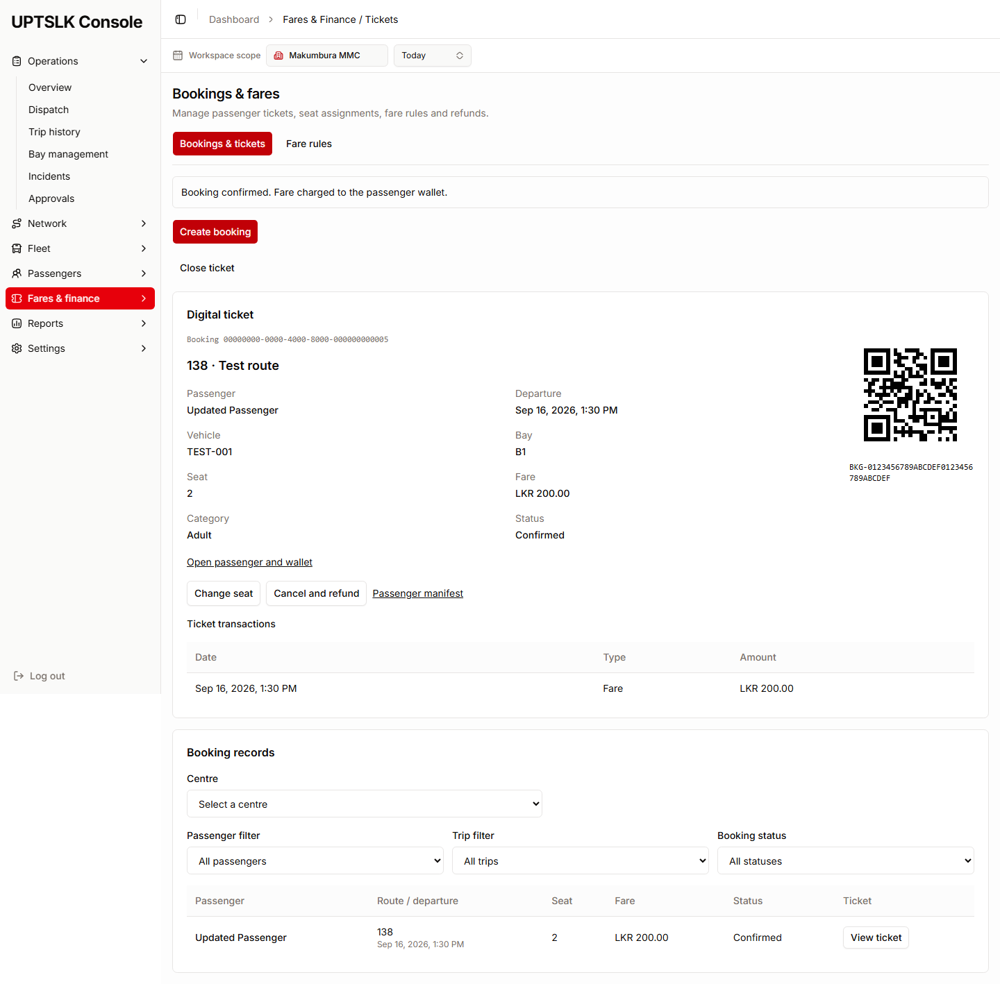
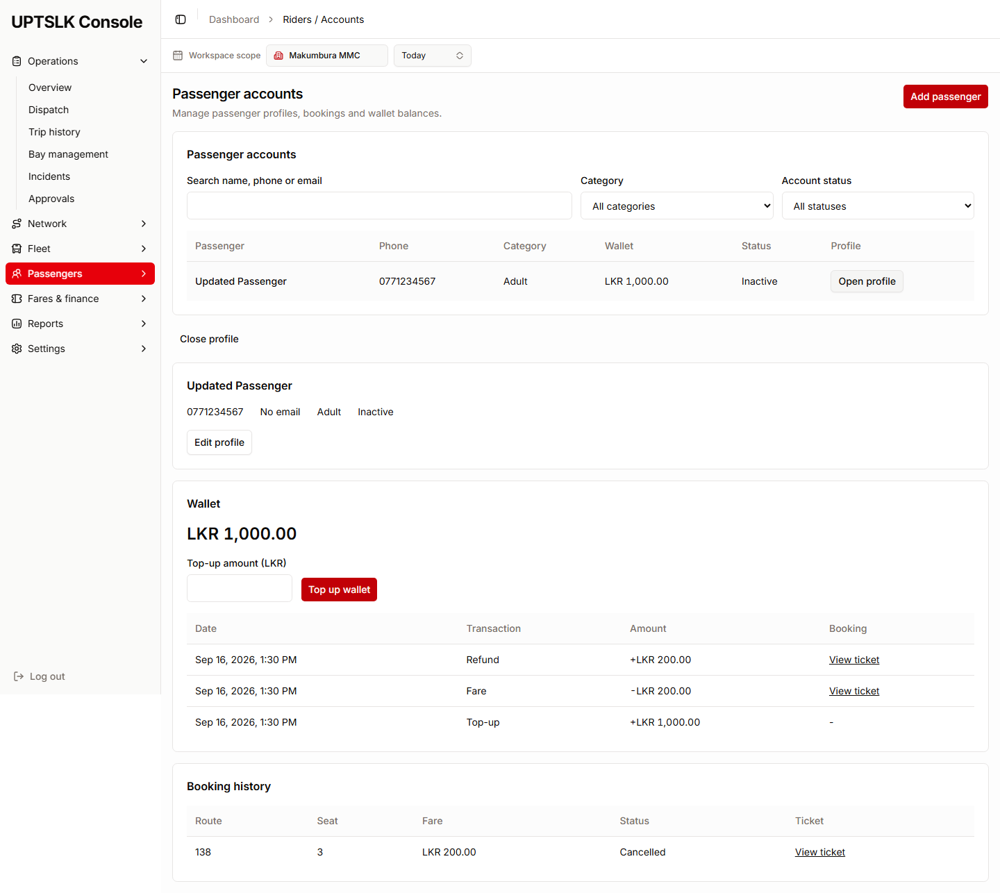
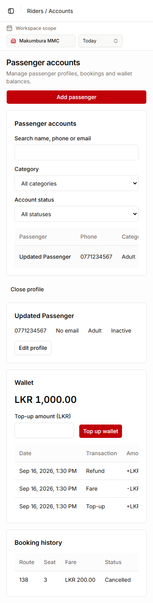

# Passenger and Fares integration

## Screens

- `/riders/accounts`: search/filter passengers; add, open profile, edit, deactivate/reactivate; top up and review wallet history.
- `/riders/support` and `/passengers/assistance`: passenger contact, booking and wallet context. The supplied APIs do not store support or assistance cases.
- `/fares/tickets`: bookings and digital QR tickets. The **Fare rules** tab contains fare list/filter/create/edit/deactivate/reactivate actions.
- `/fares/payments`: passenger wallet balances, top-ups, fare charges and refunds.
- `/passengers/flow`: capacity totals and read-only manifests.
- `/fares/reconciliation`: passenger financial transaction review. No settlement totals or day-closing actions are fabricated; there is no reconciliation endpoint.

Profiles and tickets use query parameters on existing routes and persist their selected IDs in the URL:

- `/riders/accounts?passengerId={API GUID}`
- `/fares/tickets?bookingId={API GUID}`
- `/passengers/flow?tripId={API GUID}`

The Dispatch owner can link a trip to the last URL using its API GUID. No Dispatch files or shared routes were changed.

## Implementation

All requests go through `src/lib/api/api-client.ts`. Services use relative endpoint paths; the shared client reads `VITE_API_BASE_URL`. No new client, remote QR service or feature-level API origin was added. Request/response types live in `types/`; services and TanStack Query hooks live in their prepared folders.

Passenger detail is the source of wallet balance/history. Cancellation calls DELETE with a reason and displays the API refund; it does not remove ledger rows. Mutations invalidate passenger, booking, fare, quote, capacity and manifest data. Capacity and manifests refresh every 15 seconds. Booking actions follow the current trip and booking status returned by the API.

The centre picker loads real centres for read-only trip/route lookups. A matching authenticated centre GUID is selected automatically. Demo centre labels are not sent as foreign keys; choose an API centre explicitly when using a demo login. Passenger and unfiltered booking/fare lists remain global, as exposed by their API contracts.

QR tickets encode the exact API `qrCode` reference locally using the vendored MIT-licensed Project Nayuki encoder. See `vendor/README.md` for provenance.

## Validation (2026-09-15)

From `apps/web`:

```sh
pnpm lint
pnpm build
node --test src/features/fares/tests/contracts.test.mjs
```

- Lint: passes with existing shared-component/context warnings; no warnings in the changed features.
- Build: TypeScript and production Vite build pass. Existing Vite configuration/chunk-size warnings remain.
- Five contract tests: pass (exact bodies, HTTP methods, filters, validation/conflict/network messages).
- Browser regression: passes against controlled API responses using the actual shared client and rendered app. Covers passenger/fare actions, top-ups, 400/409 messages, seat refresh after conflict, seat change, QR, manifest, refund/wallet refresh, completion eligibility, empty/error/network recovery, support/payment screens and mobile width.
- The rendered QR screenshot was independently decoded with OpenCV to its original booking reference.
- Live PostgreSQL/API browser check: passenger create/read/update/deactivate, top-up/history, and reload persistence pass. It leaves one explicitly named inactive verification passenger with a retained top-up transaction; financial records were not deleted.

### Browser checks

These scripts use Playwright, installed outside the repository so the shared package manifest and lockfile stay unchanged. Start Vite first. For example, in PowerShell:

```powershell
npm install --prefix "$env:TEMP/upts-browser-check" playwright
$env:PLAYWRIGHT_MODULE = "$env:TEMP/upts-browser-check/node_modules/playwright"
# Set WEB_URL to your running Vite origin. Use the origin allowed by API CORS for the live test.
$env:WEB_URL = Read-Host "Running Vite origin"
node src/features/fares/tests/browser.mjs
node src/features/fares/tests/live-passenger.mjs
```

Playwright also needs an installed Chromium browser. Set `SCREENSHOT_DIR` optionally to save regression screenshots. The live script creates a uniquely named test passenger, records a top-up, verifies persistence, then deactivates it. It does not erase financial records.

### Remaining team verification

The newly started local database had no centres, routes or trips. Full fare/booking financial testing against PostgreSQL therefore requires existing team trip data. Those paths have been browser-tested with controlled responses, not claimed as live database verification.

1. Select an API centre and a Scheduled/Ready/Boarding trip, create the applicable fare, and top up a passenger.
2. Confirm a booking and verify the chosen seat is unavailable; use two browser sessions to attempt the same seat and verify the conflict.
3. Try a passenger with insufficient balance and verify the API validation message.
4. Change a Confirmed booking seat while the trip is Scheduled/Ready; verify ticket and manifest.
5. Cancel an active booking and verify the refund transaction and refreshed wallet. Test completion with a separate Confirmed booking on a Dispatched/Completed trip.

Existing contracts limit two requested checks: the backend seat endpoint treats only Pending/Confirmed bookings as occupied, so Completed bookings release their seats; Completed bookings also cannot be cancelled. The frontend follows these contracts without changing them.

Existing demo authentication returns to sign-in on a full reload. Re-entering the same demo workspace preserves the profile/ticket URL and loads persisted API data. Authentication was outside this change's scope.

## Screenshots

These screenshots use the browser regression fixtures, not production records.




