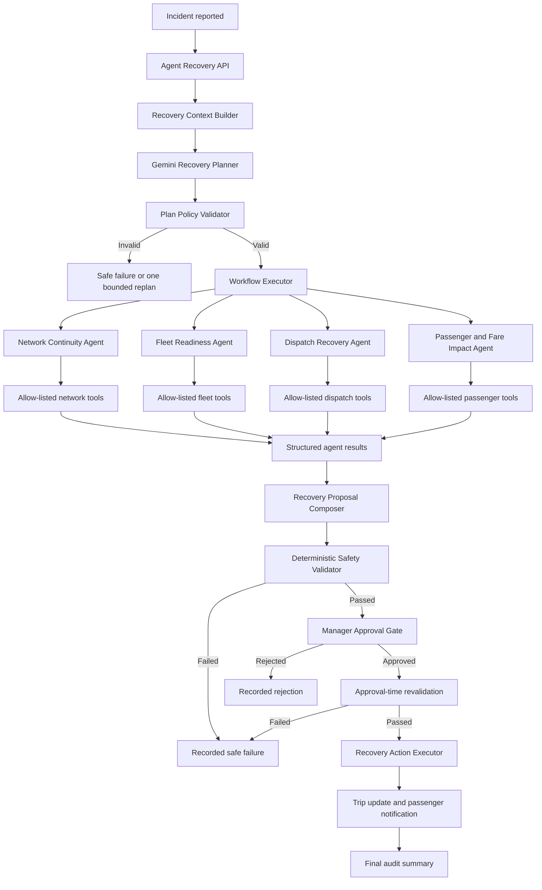

# Agent Subsystem

## UPTSLK Incident Recovery Architecture and Implementation Plan

**Project:** Unified Public Transport System  
**Subsystem:** Agentic AI Incident Recovery  
**Backend:** ASP.NET Core 8 Web API  
**Model provider:** Google Gemini API  
**Selected model:** `gemini-3.5-flash`  
**Document status:** Active implementation plan  

> [Go directly to the progress tracker](#23-progress-tracker)

## Table of contents

1. [Purpose](#1-purpose)
2. [Target outcome](#2-target-outcome)
3. [Scope](#3-scope)
4. [Architecture principles](#4-architecture-principles)
5. [Solution architecture](#5-solution-architecture)
6. [Component responsibilities](#6-component-responsibilities)
7. [Technology stack](#7-technology-stack)
8. [Core contracts](#8-core-contracts)
9. [Complete workflow](#9-complete-workflow)
10. [Gemini orchestrator](#10-gemini-orchestrator)
11. [Specialized agents](#11-specialized-agents)
12. [Controlled tools](#12-controlled-tools)
13. [Shared workflow state](#13-shared-workflow-state)
14. [Proposal composition](#14-proposal-composition)
15. [Deterministic validation](#15-deterministic-validation)
16. [Human approval and action execution](#16-human-approval-and-action-execution)
17. [Observability and audit trail](#17-observability-and-audit-trail)
18. [Security and safe failure](#18-security-and-safe-failure)
19. [API design](#19-api-design)
20. [Testing and evaluation](#20-testing-and-evaluation)
21. [Demonstration workflow](#21-demonstration-workflow)
22. [References](#22-references)
23. [Progress tracker](#23-progress-tracker)

## 1. Purpose

The Agent Subsystem handles operational recovery when an incident disrupts a scheduled trip. It accepts a recovery objective, gathers the required operational context, creates a structured plan, delegates work to specialized agents, validates the resulting proposal, pauses for authorized human approval, and applies the approved recovery safely.

The subsystem focuses on a meaningful transport problem rather than general conversation. Its main purpose is to restore a disrupted service while protecting passenger safety, resource availability, operational consistency, and management control.

## 2. Target outcome

For a supported incident, the subsystem will produce one of two outcomes:

1. A validated recovery proposal that is approved by an authorized manager and safely applied.
2. A safe failure that clearly records why recovery could not continue.

A complete recovery proposal can include:

- A revised departure time.
- A replacement vehicle.
- A replacement driver.
- A departure bay.
- A route or service continuity recommendation.
- The number of affected passengers.
- A passenger notification plan.
- Fare or refund guidance when required.
- Warnings and validation evidence.

## 3. Scope

### 3.1 Included

- Breakdown and operational incident recovery.
- LLM-based planning and agent delegation.
- Four specialized transport agents.
- Allow-listed transport tools.
- Structured tool inputs and outputs.
- Persisted workflow state.
- Deterministic business-rule validation.
- Human approval for high-impact actions.
- Approved trip reassignment and schedule updates.
- Passenger notification after approval.
- Execution history, failures, retries, timings, and final summaries.

### 3.2 Excluded

- A general-purpose chatbot.
- Unrestricted model access to the database.
- Arbitrary SQL generated by the model.
- Autonomous approval of high-impact actions.
- Model-generated vehicle, driver, trip, route, or bay identifiers.
- Direct access to secrets from prompts or agents.
- Unlimited planning or retry loops.

## 4. Architecture principles

### 4.1 LLM planning with deterministic execution

Gemini will decide how to approach the objective and which specialists should participate. ASP.NET Core services will execute the plan through controlled code paths.

### 4.2 Deterministic safety boundaries

Vehicle capacity, maintenance state, driver availability, bay availability, schedule conflicts, centre ownership, and authorization will always be checked by C# business rules. Model output cannot override these rules.

### 4.3 Least privilege

Each agent receives access only to the tools required for its responsibility. Agents do not receive unrestricted `AppDbContext` access.

### 4.4 Structured communication

Plans, agent inputs, tool inputs, tool outputs, recommendations, proposals, validation results, approval decisions, and final outcomes use versioned structured contracts.

### 4.5 Human control

The subsystem can prepare and validate a recommendation, but an authorized user must approve the high-impact action before trip assignments, times, bays, or passenger notifications are changed.

### 4.6 Auditable operation

Every meaningful decision is persisted with the workflow ID, actor, model, prompt version, agent, tool, input, output, duration, retry count, validation result, and approval decision.

### 4.7 Bounded autonomy

Planning and replanning have explicit limits. A timeout, invalid plan, unavailable provider, unsupported action, or failed validation produces a recorded safe failure or an explicitly recorded fallback plan.

## 5. Solution architecture



### 5.1 Main execution path

```text
Objective
  -> Context
  -> LLM plan
  -> Plan validation
  -> Agent execution
  -> Proposal composition
  -> Safety validation
  -> Human approval
  -> Revalidation
  -> Action execution
  -> Auditable outcome
```

## 6. Component responsibilities

| Component | Responsibility | May change operational data |
| --- | --- | --- |
| Agent Recovery Controller | Exposes start, status, detail, approval, and summary endpoints | No |
| Recovery Context Builder | Creates a minimal, safe incident snapshot for planning | No |
| Gemini Recovery Planner | Produces a structured plan and selects suitable agents | No |
| Plan Policy Validator | Rejects unsafe, invalid, cyclic, or unsupported plans | No |
| Workflow Executor | Executes validated steps and manages dependencies | No |
| Agent Registry | Resolves stable agent IDs to implementations | No |
| Specialized Agents | Analyze one bounded transport responsibility | No |
| Tool Gateway | Validates, executes, times, and audits allow-listed tools | No |
| Proposal Composer | Combines compatible agent results into one proposal | No |
| Safety Validator | Applies deterministic operational rules | No |
| Approval Service | Records approve, reject, or revision decisions | No |
| Recovery Action Executor | Applies an approved and revalidated proposal | Yes |
| Notification Service | Sends or records approved passenger notifications | Yes |
| Workflow Repository | Persists state, steps, evidence, decisions, and outcomes | Yes, workflow data only |

## 7. Technology stack

| Area | Technology | Purpose |
| --- | --- | --- |
| Backend | ASP.NET Core 8 | API, dependency injection, authorization, orchestration, and execution |
| Persistence | Entity Framework Core | Durable workflow and operational data access |
| Database | PostgreSQL | Workflow state, operational data, approvals, and audit evidence |
| LLM | Gemini 3.5 Flash | Structured planning, bounded replanning, and final explanation |
| Model ID | `gemini-3.5-flash` | Pinned stable model identifier |
| Gemini SDK | `Google.GenAI` | Official .NET Gemini API client |
| Serialization | `System.Text.Json` | Typed JSON contracts and persisted JSON documents |
| Authentication | Existing cookie and role-based authentication | User identity and access control |
| Frontend | React and TypeScript | Workflow start, live status, approval, and audit views |
| Mobile | Flutter | Passenger notification and ticket experience where required |
| Logging | ASP.NET Core `ILogger` plus persisted audit records | Technical and business observability |
| Testing | xUnit and ASP.NET Core test infrastructure | Unit, integration, policy, and workflow tests |

### 7.1 Model decision

Gemini 3.5 Flash is suitable for the planner because it is a stable model that supports structured outputs, function calling, thinking, and multi-step agentic execution. The model identifier will be pinned to `gemini-3.5-flash` so assessed behavior is not changed by a moving alias.

The model is used for planning and explanation. It is not trusted as the source of truth for operational availability or safety.

### 7.2 Package and configuration

The API will use the official package:

```bash
dotnet add package Google.GenAI
```

Configuration will follow the ASP.NET options pattern:

```json
{
  "AgentAi": {
    "Enabled": true,
    "Provider": "Gemini",
    "Model": "gemini-3.5-flash",
    "PromptVersion": "recovery-planner-v1",
    "TimeoutSeconds": 20,
    "MaxPlanningRetries": 1,
    "MaxReplanAttempts": 1,
    "MaximumPlanSteps": 8
  }
}
```

The API key will be supplied through an environment variable or local user secrets:

```text
GEMINI_API_KEY=<local or deployed secret>
```

The key must never be committed, returned by an API, included in a prompt, or written to logs.

## 8. Core contracts

### 8.1 Stable agent identifiers

Display names will not be used for routing. The workflow will use stable identifiers:

```csharp
public enum RecoveryAgentId
{
    NetworkContinuity,
    FleetReadiness,
    DispatchRecovery,
    PassengerFareImpact
}
```

### 8.2 Planning input

```csharp
public sealed record RecoveryPlanningInput(
    Guid WorkflowId,
    string Objective,
    IncidentPlanningSnapshot Incident,
    TripPlanningSnapshot Trip,
    int AffectedPassengers,
    IReadOnlyList<AgentCapability> AvailableAgents);
```

Only the minimum operational context required for planning is included. Passenger names, emails, phone numbers, authentication data, payment data, secrets, and unrestricted entity graphs are excluded.

### 8.3 Structured plan

```csharp
public sealed record RecoveryPlan(
    string ObjectiveSummary,
    IReadOnlyList<PlannedRecoveryStep> Steps,
    string CompletionCondition);

public sealed record PlannedRecoveryStep(
    string StepId,
    int Order,
    RecoveryAgentId AgentId,
    string Objective,
    IReadOnlyList<string> DependsOn);
```

### 8.4 Agent contract

```csharp
public interface IRecoveryAgent
{
    RecoveryAgentId Id { get; }
    string Responsibility { get; }
    IReadOnlySet<RecoveryToolName> AllowedTools { get; }

    Task<AgentExecutionResult> ExecuteAsync(
        AgentExecutionContext context,
        CancellationToken cancellationToken);
}
```

### 8.5 Tool contract

Every tool will have a typed request and response:

```csharp
public sealed record FindReplacementVehiclesInput(
    Guid CentreId,
    Guid ExcludedVehicleId,
    int RequiredCapacity,
    DateTime ProposedDeparture);

public sealed record VehicleCandidate(
    Guid VehicleId,
    string PlateNumber,
    int Capacity,
    bool IsMaintenanceSafe);

public sealed record FindReplacementVehiclesResult(
    IReadOnlyList<VehicleCandidate> Candidates,
    DateTime CheckedAt);
```

### 8.6 Agent result

```csharp
public sealed record AgentExecutionResult(
    RecoveryAgentId AgentId,
    string Summary,
    IReadOnlyList<string> Reasons,
    IReadOnlyList<string> Warnings,
    IReadOnlyList<ResourceCandidate> Candidates,
    IReadOnlyList<ToolExecutionRecord> ToolCalls);
```

## 9. Complete workflow

### 9.1 Start

1. An authorized operations user reports an incident against a scheduled trip.
2. The user starts recovery with a domain objective.
3. The API validates the incident, trip state, user role, centre scope, and duplicate active workflows.
4. A new workflow ID is created and persisted with `Running` status.

### 9.2 Build planning context

1. Load the incident and affected trip.
2. Count confirmed and pending passengers.
3. Build a small planning snapshot.
4. Attach the available agent catalog and each agent's responsibility.
5. Exclude personal data and secrets.

### 9.3 Create the plan

1. Send the objective, incident snapshot, trip snapshot, constraints, and agent catalog to Gemini.
2. Require Gemini to return a `RecoveryPlan` matching the JSON schema.
3. Record the provider, model, prompt version, latency, token usage, and raw structured response.
4. Reject non-JSON or schema-invalid output.

### 9.4 Validate the plan

The policy validator confirms that:

- Every agent ID exists in the registry.
- Every step has a unique ID.
- Step order is valid.
- Dependencies reference existing earlier steps.
- The dependency graph has no cycles.
- The plan does not exceed the step limit.
- The plan contains only supported objectives.
- The model has not requested a write action.
- Deterministic safety validation remains mandatory.
- Human approval remains mandatory.
- A breakdown assessment includes the required fleet, dispatch, network, and passenger responsibilities.

One corrective planning attempt is allowed when a plan is structurally invalid. A second failure ends with a safe and recorded planning failure.

### 9.5 Execute the plan

1. Persist all validated plan steps as pending.
2. Select steps whose dependencies are complete.
3. Resolve each agent through the agent registry.
4. Build the agent's typed input from workflow state and dependency outputs.
5. Execute the agent with its timeout and retry policy.
6. Execute tools only through the controlled tool gateway.
7. Persist agent inputs, outputs, tools, timings, retries, warnings, and errors.
8. Continue until the plan completes or can no longer make safe progress.

Independent steps may run concurrently. Dependent steps run only when their required evidence is available.

### 9.6 Compose and validate the proposal

1. Combine compatible vehicle, driver, bay, time, route, and passenger results.
2. Reject missing or contradictory results.
3. Run all deterministic safety checks.
4. Persist the proposal and validation results.
5. Fail safely when no valid combination exists.

### 9.7 Request approval

1. Change the workflow status to `PausedForApproval`.
2. Create an approval request containing the proposed changes and warnings.
3. Allow an authorized Admin or Centre Manager to approve, reject, or request revision.
4. Record the reviewer, decision, note, and decision time.

### 9.8 Apply the approved recovery

1. Reload all affected operational records.
2. Repeat deterministic validation against current data.
3. Stop if availability, capacity, maintenance, or conflict state changed.
4. Apply the trip changes in a transaction.
5. Resolve the incident where appropriate.
6. Create approved passenger notifications.
7. Record the applied time and final outcome.

### 9.9 Complete

1. Generate a concise manager-facing execution summary.
2. Mark the workflow `Completed` or `Failed`.
3. Persist completion time and final outcome.
4. Expose the complete audit record through the workflow detail endpoint.

## 10. Gemini orchestrator

### 10.1 Responsibilities

Gemini will:

- Interpret the recovery objective.
- Classify the operational needs of the incident.
- Select relevant agents from the supplied catalog.
- Create ordered steps and dependencies.
- Request one bounded replan when evidence shows the plan cannot complete.
- Summarize the validated recommendation for the approving manager.
- Summarize the final completed or failed outcome.

### 10.2 Restrictions

Gemini will not:

- Query PostgreSQL directly.
- Receive unrestricted application services.
- Create operational resource IDs.
- Mark its own output as valid.
- approve a proposal.
- Apply changes to a trip.
- Send notifications.
- Increase its retry or step limit.
- Modify the list of allowed agents or tools.

### 10.3 Prompt structure

The planning request will contain four separate parts:

1. System instructions describing the planner role and security restrictions.
2. The agent capability catalog.
3. The typed incident and trip snapshot.
4. The structured output schema.

The user objective is treated as untrusted data. It is clearly delimited and is never allowed to replace system constraints.

### 10.4 Planning policy

The planner will use a low or medium thinking level appropriate for a small structured plan. The application will not request or persist private chain-of-thought content. It will store only the structured plan and a short decision summary required for the audit trail.

### 10.5 Provider failure behavior

If Gemini times out or is unavailable:

1. Record the provider error and duration.
2. Retry once within the configured limit.
3. Either use an explicitly recorded safe recovery template or stop with a safe planning failure.
4. Never silently claim that an LLM-generated plan was used.

The assessed demonstration workflow should run using Gemini. Any fallback execution must be clearly identified as `Fallback` in the workflow record.

## 11. Specialized agents

### 11.1 Network Continuity Agent

**Responsibility:** Protect service continuity and identify a feasible operating path.

**Inputs:**

- Incident and trip identifiers.
- Route direction.
- Departure and arrival centres.
- Current bay and departure time.
- Relevant outputs from earlier steps.

**Allowed tools:**

- Find available departure bays.
- Read route direction and ordered stops.
- Find supported alternative route options.
- Find feasible revised departure windows.

**Output:**

- Recommended bay, route option, and departure time.
- Supporting reasons.
- Warnings when the current route or bay must be retained.

### 11.2 Fleet Readiness Agent

**Responsibility:** Identify a roadworthy and capacity-safe replacement vehicle.

**Inputs:**

- Centre ID.
- Affected vehicle ID.
- Passenger count.
- Proposed departure window.
- Accessibility requirements where available.

**Allowed tools:**

- Find active centre vehicles.
- Check maintenance state.
- Check vehicle schedule conflicts.
- Compare capacity and accessibility.

**Output:**

- Ranked replacement vehicle candidates.
- Capacity evidence.
- Maintenance evidence.
- Warnings or a safe no-candidate result.

### 11.3 Dispatch Recovery Agent

**Responsibility:** Identify a conflict-free replacement driver for the exact proposed vehicle, bay, and time combination.

**Inputs:**

- Proposed vehicle ID.
- Proposed bay ID.
- Proposed departure time.
- Estimated trip duration.
- Affected trip and centre IDs.

**Allowed tools:**

- Find active centre drivers.
- Check driver assignment conflicts.
- Check combined driver, vehicle, and bay conflicts.

**Output:**

- Ranked driver candidates.
- Conflict evidence.
- Warnings or a safe no-candidate result.

### 11.4 Passenger and Fare Impact Agent

**Responsibility:** Assess passenger impact and prepare the notification and fare response.

**Inputs:**

- Trip ID.
- Passenger count.
- Proposed delay.
- Capacity difference.
- Route or service changes.

**Allowed tools:**

- Count affected confirmed and pending passengers.
- Read applicable fare and refund rules.
- Prepare a notification request.
- Read notification delivery results after approval.

**Output:**

- Passenger impact summary.
- Notification recommendation.
- Fare or refund recommendation.
- Warning when capacity or service changes affect bookings.

## 12. Controlled tools

### 12.1 Tool gateway

All agent tools will execute through a gateway that performs:

- Tool name validation.
- Agent permission validation.
- Input schema validation.
- Business input validation.
- Cancellation and timeout handling.
- Retry enforcement for read-only operations.
- Structured output validation.
- Duration and error recording.
- Redaction of sensitive values.

### 12.2 Tool permissions

| Agent | Allowed tools |
| --- | --- |
| Network Continuity | Route, direction, stop, bay, and departure-window read tools |
| Fleet Readiness | Vehicle, capacity, maintenance, accessibility, and vehicle-conflict read tools |
| Dispatch Recovery | Driver and combined resource-conflict read tools |
| Passenger and Fare Impact | Booking-count, fare-rule, and notification-preparation tools |

Write tools are not exposed to specialist agents. Approved writes are handled only by `RecoveryActionExecutor`.

### 12.3 Tool audit record

Each call records:

- Workflow ID.
- Step ID.
- Agent ID.
- Tool name and contract version.
- Validated input.
- Structured output.
- Start time and duration.
- Success or failure.
- Retry count.
- Sanitized error.

## 13. Shared workflow state

The durable workflow state will contain:

| Data | Purpose |
| --- | --- |
| Workflow ID | Correlates every execution record |
| Centre, incident, and trip IDs | Establishes domain scope |
| Objective | Records the requested outcome |
| Status | Tracks running, approval, completion, or failure |
| Planning mode | Records Gemini or fallback planning |
| Provider and model | Records the model used |
| Prompt version | Makes planning reproducible and auditable |
| Plan JSON | Stores the validated structured plan |
| Completed steps | Supports status and resume behavior |
| Agent outputs | Preserves specialist evidence |
| Tool calls | Preserves controlled data access evidence |
| Proposal JSON | Stores the complete proposed change |
| Validation JSON | Stores every deterministic check |
| Approval status | Records pending, approved, rejected, or revision requested |
| Errors and retries | Explains degraded or failed execution |
| Usage and timings | Supports cost and performance evaluation |
| Final outcome | Records applied recovery or safe failure |

Workflow transitions will be explicit and validated. Unsupported transitions are rejected.

## 14. Proposal composition

The proposal composer is deterministic. It combines structured results only when they refer to a compatible recovery combination.

The composer will:

1. Select a network recommendation.
2. Select a vehicle that satisfies capacity and readiness constraints.
3. Select a driver validated against that vehicle, bay, and time.
4. Attach passenger impact and notification information.
5. Preserve all warnings.
6. Reject incomplete or contradictory combinations.

Gemini may explain why a validated combination is suitable, but it does not create or override the selected resource IDs.

## 15. Deterministic validation

Validation runs before approval and again immediately after approval.

Required checks include:

- Vehicle exists.
- Vehicle is active.
- Vehicle belongs to the required centre.
- Vehicle is not blocked by maintenance.
- Vehicle has sufficient passenger capacity.
- Accessibility requirements are satisfied when applicable.
- Driver exists.
- Driver is active.
- Driver belongs to the required centre.
- Driver has no overlapping assignment.
- Bay exists at the correct departure centre.
- Bay is available.
- Vehicle, driver, and bay have no conflicting trip.
- Proposed time is within the supported recovery window.
- Route direction and centre relationship are valid.
- Passenger impact has been assessed.
- Notification action has an approved template and audience.

Any failed check prevents execution and produces a clear validation result.

## 16. Human approval and action execution

### 16.1 Approval roles

Only users with the `Admin` or `CentreManager` role can approve or reject a recovery proposal. Centre-scoped authorization must also confirm that the manager controls the affected centre.

### 16.2 Approval choices

- **Approve:** Revalidate and apply the proposal.
- **Reject:** End the workflow with a recorded rejection.
- **Request revision:** Return the workflow for one bounded replan using the manager's structured note.

### 16.3 High-impact actions

The following actions require approval:

- Replace the assigned vehicle.
- Replace the assigned driver.
- Change the departure bay.
- Change the scheduled departure time.
- Select a different route option.
- Notify passengers about an operational change.
- Apply a fare adjustment or refund action.

### 16.4 Transaction boundary

Approved operational changes will be applied inside a database transaction where practical. Notification records will be created as part of the approved action and delivered through a retry-safe notification process.

## 17. Observability and audit trail

### 17.1 Persisted observability

The subsystem stores:

- Workflow creation and completion times.
- Model provider and model name.
- Prompt version.
- Planning duration and token usage.
- Structured plan.
- Agent start and completion times.
- Tool inputs and outputs.
- Tool durations and failures.
- Retry counts.
- Validation results.
- Proposal details.
- Approval actor and decision.
- Applied actions.
- Notification delivery status.
- Final result or safe-failure reason.

### 17.2 Application logs

Structured application logs will include the workflow ID and step ID as correlation properties. Logs must not include secrets, authentication cookies, raw payment details, or unnecessary passenger personal data.

### 17.3 Frontend visibility

The workflow UI will show:

- The objective.
- The generated plan.
- The active step.
- Participating agents.
- Tool and validation summaries.
- Warnings and errors.
- Approval state.
- Final applied changes or safe failure.

## 18. Security and safe failure

### 18.1 Prompt security

- Treat incident titles, descriptions, and objectives as untrusted text.
- Apply length limits and required-field validation.
- Delimit user-provided content in the planner request.
- Keep system constraints separate from domain content.
- Reject planner output that references unknown agents, tools, or actions.
- Do not place secrets or personal passenger data in prompts.

### 18.2 API security

- Require authentication for all recovery endpoints.
- Restrict start and view operations to approved operational roles.
- Restrict approval to Admin and Centre Manager roles.
- Enforce centre ownership where applicable.
- Apply request validation and rate limits.
- Protect the Gemini API key through secret configuration.

### 18.3 Runtime limits

- Maximum planning attempts: 2 total.
- Maximum replanning attempts: 1.
- Maximum plan steps: 8.
- Per-agent timeout: configured and bounded.
- Per-tool timeout: configured and bounded.
- Retry only idempotent read operations automatically.
- Never retry high-impact writes without idempotency protection.

### 18.4 Safe-failure cases

The workflow stops safely when:

- Gemini is unavailable and no approved fallback is enabled.
- The plan remains invalid after the retry limit.
- An agent requests an unauthorized tool.
- Required structured output is missing.
- No suitable vehicle, driver, bay, route, or time is available.
- Capacity is insufficient.
- A maintenance or schedule conflict exists.
- Approval is rejected.
- Operational state changes before execution.
- Notification preparation or execution violates policy.

Every safe failure records a clear reason and does not modify the trip.

## 19. API design

### 19.1 Start a workflow

```http
POST /api/v1/agent-recovery/workflows
```

```json
{
  "incidentId": "00000000-0000-0000-0000-000000000000",
  "objective": "Restore this disrupted trip with a safe replacement service and notify affected passengers."
}
```

### 19.2 List workflows

```http
GET /api/v1/agent-recovery/workflows?centreId={centreId}&status={status}
```

### 19.3 View workflow detail

```http
GET /api/v1/agent-recovery/workflows/{workflowId}
```

The detail response includes the plan, steps, agents, tool summaries, proposal, validation results, approval history, errors, and final outcome.

### 19.4 Submit an approval decision

```http
POST /api/v1/agent-recovery/workflows/{workflowId}/approval
```

```json
{
  "decision": "Approved",
  "note": "Replacement resources confirmed by the centre manager."
}
```

### 19.5 Request revision

```json
{
  "decision": "RevisionRequested",
  "note": "Use an accessible replacement vehicle and keep the departure at the original centre."
}
```

## 20. Testing and evaluation

### 20.1 Unit tests

- Plan schema validation.
- Unknown agent rejection.
- Duplicate and cyclic dependency rejection.
- Step-count limit enforcement.
- Tool permission enforcement.
- Tool input validation.
- Proposal composition.
- Capacity validation.
- Maintenance validation.
- Driver, vehicle, and bay conflict validation.
- Approval state transitions.
- Safe failure behavior.

### 20.2 Planner tests

The orchestrator will depend on an interface so tests can use a fake planner. Most automated tests will not call Gemini.

Separate provider integration tests will verify:

- Authentication and configuration.
- Structured plan generation.
- Valid agent selection.
- Invalid output handling.
- Timeout behavior.
- Token and latency recording.

### 20.3 Integration tests

- Start workflow from a real incident record.
- Persist generated plan and steps.
- Execute all four specialists.
- Persist tool calls and outputs.
- Reject an unsafe proposal.
- Pause a safe proposal for approval.
- Reject unauthorized approval.
- Revalidate and apply authorized approval.
- Create passenger notification records.
- Return complete workflow audit details.

### 20.4 Agentic AI evaluation

The evaluation dataset will contain representative incident scenarios:

- Vehicle breakdown with a valid replacement.
- Vehicle breakdown with insufficient replacement capacity.
- Driver unavailability.
- Bay closure.
- Route disruption.
- Incident with no affected passengers.
- Incident with conflicting replacement resources.
- Gemini timeout or malformed plan.
- Manager rejection.
- Operational state change after approval was requested.

Measures will include:

- Valid plan rate.
- Correct agent-selection rate.
- Tool success rate.
- Deterministic validation accuracy.
- Unsafe-action prevention rate.
- Successful recovery rate.
- Safe-failure rate.
- Planning latency.
- End-to-end workflow latency.
- Token usage and estimated model cost.
- Human approval completion rate.

## 21. Demonstration workflow

The assessed demonstration will use a breakdown incident linked to an active scheduled trip with bookings.

### 21.1 Demonstration sequence

1. A manager opens the incident and enters the recovery objective.
2. The API creates and persists the workflow.
3. Gemini receives the safe planning snapshot and produces a structured plan.
4. The policy validator accepts the plan.
5. The Network Continuity Agent checks service continuity, bay, route, and time options.
6. The Fleet Readiness Agent selects a maintenance-safe vehicle with sufficient capacity.
7. The Dispatch Recovery Agent finds a driver for the exact proposed combination.
8. The Passenger and Fare Impact Agent calculates impact and prepares notification guidance.
9. The proposal composer creates one compatible proposal.
10. Deterministic checks validate resource state, capacity, centre ownership, and conflicts.
11. The workflow pauses for manager approval.
12. The UI displays the plan, evidence, warnings, and proposed changes.
13. The authorized manager approves the proposal.
14. The API repeats deterministic validation.
15. The action executor updates the trip and resolves the incident.
16. Passenger notification records are created and delivered.
17. The completed workflow shows the full audit summary.

### 21.2 Evidence to show

- Domain objective.
- Gemini-generated structured plan.
- Four distinct agent identities and responsibilities.
- Agent input and output contracts.
- Allow-listed tool calls.
- Persisted workflow and step state.
- Deterministic validation results.
- Paused approval state.
- Authorized approval decision.
- Applied recovery action.
- Passenger notification result.
- Timings, retries, errors, and final summary.

## 22. References

- [Gemini 3.5 Flash model documentation](https://ai.google.dev/gemini-api/docs/models/gemini-3.5-flash)
- [Gemini model identifiers and lifecycle](https://ai.google.dev/gemini-api/docs/models)
- [Google Gen AI SDK libraries](https://ai.google.dev/gemini-api/docs/libraries)
- [Google Gen AI .NET SDK](https://googleapis.github.io/dotnet-genai/)
- [Gemini function calling](https://ai.google.dev/gemini-api/docs/function-calling)
- [Gemini structured outputs](https://ai.google.dev/gemini-api/docs/generate-content/structured-output)

## 23. Progress tracker

### Status definitions

| Status | Meaning |
| --- | --- |
| Done | Implemented and available in the repository |
| In progress | Design or implementation work is actively underway |
| To do | Planned work that has not started |
| Verify | Implemented work that requires focused automated or demonstration verification |

### Ordered implementation progress

| Order | Area | Work item | Status | Completion evidence | Next action |
| ---: | --- | --- | --- | --- | --- |
| 1 | Domain | Incident-linked recovery objective and workflow creation | Done | Workflow can be started for an eligible trip incident and stores its planning evidence | Verify the complete objective-to-outcome path with stable demonstration data |
| 2 | Agents | Network Continuity Agent with a distinct responsibility | Done | Agent produces a structured bay and time recommendation | Extract network queries into controlled tools and add alternative-route search |
| 3 | Agents | Fleet Readiness Agent with a distinct responsibility | Done | Agent produces a structured vehicle recommendation | Extract vehicle and maintenance queries into fleet tools |
| 4 | Agents | Dispatch Recovery Agent with a distinct responsibility | Done | Agent produces a structured driver recommendation | Make it consume the exact network and fleet outputs |
| 5 | Agents | Passenger and Fare Impact Agent with a distinct responsibility | Done | Agent produces structured passenger-impact guidance | Add fare-rule checks and notification preparation tools |
| 6 | State | Durable workflow, step, proposal, and validation state | Done | Workflow, plan, agent steps, planner input and output, validation, and approval records are stored in PostgreSQL | Add a dedicated final-summary field after the execution result format is finalized |
| 7 | Reliability | Agent timeouts, retry limits, and safe failure | Done | Agent runner records errors, retries, and duration | Add equivalent planner and tool gateway policies |
| 8 | Safety | Pre-approval deterministic validation | Done | Capacity, availability, centre, and conflict checks are recorded | Add maintenance, route, time-window, and accessibility checks |
| 9 | Approval | Role-protected manager approval gate | Done | Workflow pauses and only authorized roles can decide | Add centre-scope enforcement and revision requests |
| 10 | Execution | Approval-time revalidation and trip update | Done | Approved proposals are rechecked before trip mutation | Move writes into a dedicated transactional action executor |
| 11 | Observability | Workflow list, detail, plan, tool, validation, and approval views | In progress | API workflow details expose Gemini mode, model, prompt version, duration, token usage, and fallback reason | Present the new planning evidence and future notification evidence in the React audit view |
| 12 | Design | LLM orchestrator architecture and Gemini model decision | Done | This architecture document and pinned model decision exist | Record the model decision in an ADR |
| 13 | Gemini | Add the official `Google.GenAI` package and options configuration | Done | `Google.GenAI`, validated `AgentAiOptions`, environment-key loading, timeout, and bounded retry settings are implemented | Configure `GEMINI_API_KEY` locally and run the provider integration check |
| 14 | Contracts | Add typed planner input, plan, step, capability, and metadata contracts | Done | Typed incident snapshot, capability, plan, step, response, and audit contracts are implemented | Add serialization snapshot coverage when the schema is versioned |
| 15 | Planning | Implement `IRecoveryPlanner` and `GeminiRecoveryPlanner` | Done | Gemini planning uses prompt v1 and requests schema-constrained JSON output | Run a real Gemini planning request with development credentials |
| 16 | Policy | Implement deterministic plan-policy validation | Done | Registered agents, required roles, unique steps, order, dependencies, and maximum step count are checked before execution | Extend tests for duplicate agents and maximum-step enforcement |
| 17 | Tools | Extract direct database queries into allow-listed tool services | To do | Agents receive tool interfaces instead of unrestricted database access | Implement network, fleet, dispatch, and passenger tool services |
| 18 | Execution | Add registry-based and dependency-aware workflow execution | In progress | A stable agent registry resolves and runs only the validated planned agents in plan order | Pass typed dependency outputs into later agents and add a dependency-aware scheduler |
| 19 | Replanning | Add one bounded Gemini replan path | To do | Recoverable no-candidate results can produce one revised valid plan | Define replan reasons and limits |
| 20 | Composition | Strengthen deterministic proposal compatibility rules | To do | Vehicle, driver, bay, time, and route always form one checked combination | Add proposal composer tests |
| 21 | Notifications | Create approved passenger notifications | To do | A completed recovery creates delivery records for affected bookings | Implement notification preparation and delivery |
| 22 | Audit | Persist provider, model, prompt version, usage, and planning latency | Done | The migration, workflow entity, database mapping, and workflow API response include planning audit metadata | Display these fields in the workflow audit UI |
| 23 | Security | Add prompt validation, redaction, rate limits, and centre-scope checks | To do | Security tests reject unsupported input and cross-centre actions | Implement filters and authorization policies |
| 24 | Tests | Add unit tests for plan, tools, validation, approval, and execution | In progress | Four focused plan-policy tests pass in `apps/api.Tests` | Add planner fallback, tool permission, approval, and action-execution tests, then run them in CI |
| 25 | Evaluation | Build the incident evaluation dataset and record measurements | To do | Evaluation report contains accuracy, safety, latency, and cost results | Define fixtures and evaluation runner |
| 26 | Demonstration | Verify one complete Gemini-planned assessed workflow | To do | Recorded run shows objective through final outcome with all evidence | Prepare stable seed data and demonstration script |
| 27 | Documentation | Add ADR, API examples, test results, screenshots, and final report evidence | To do | Submission report links to verified implementation evidence | Update documentation after implementation and testing |
