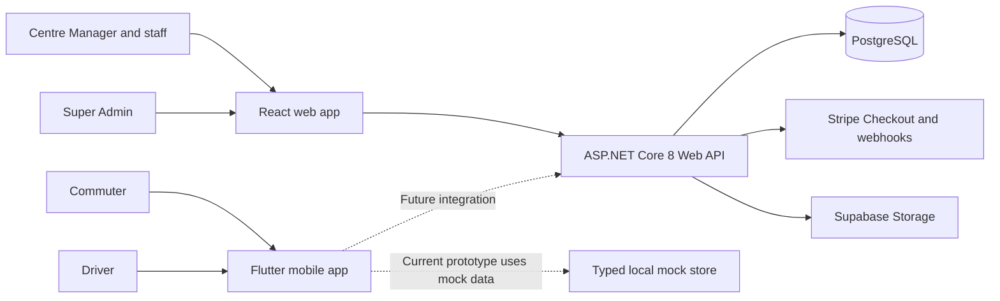
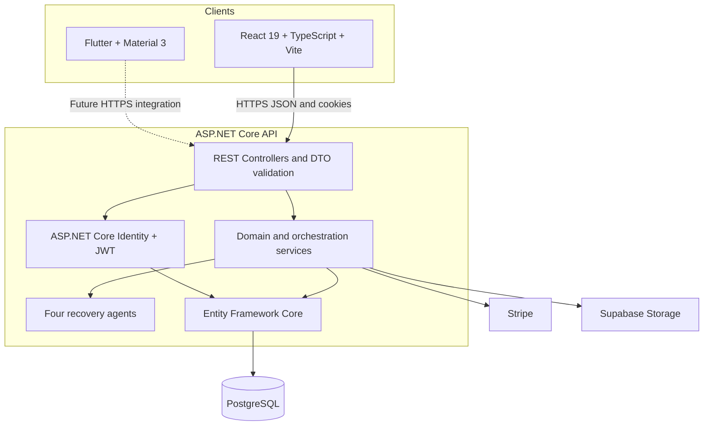
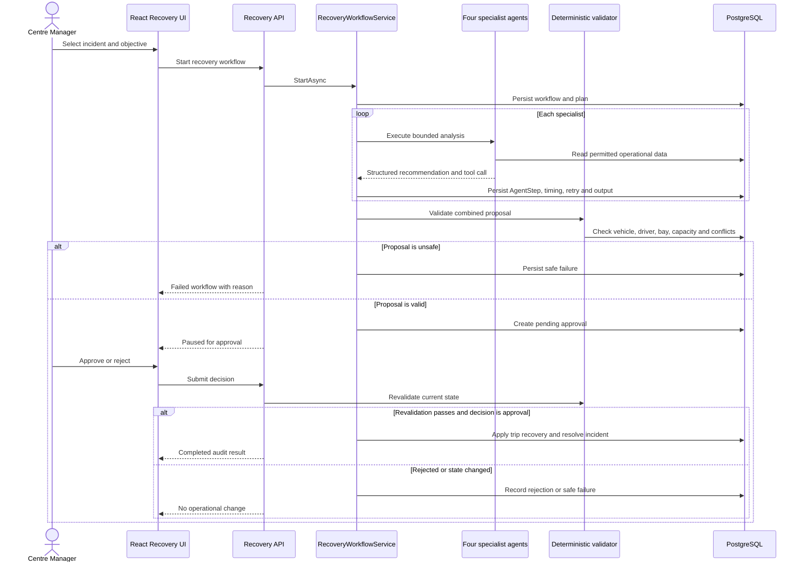
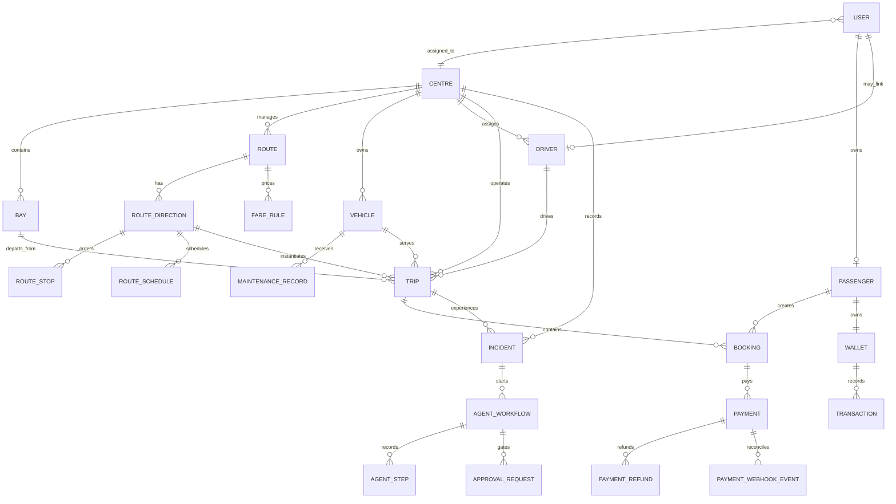
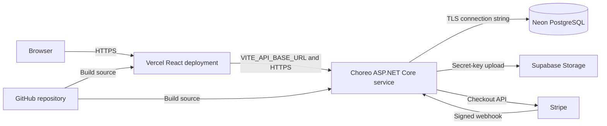

# SE3090 Software Engineering Frameworks

## Consolidated Group and Individual Final Report

### Unified Public Transport System (UPTSLK)

**Institution:** Sri Lanka Institute of Information Technology  
**Module:** SE3090 Software Engineering Frameworks  
**Academic year:** 2026  
**Assignment:** Assignment 1  
**Project:** Unified Public Transport System (UPTSLK)  
**Submission date:** `[TODO: DD Month 2026]`  
**Lecturer:** `[TODO: Lecturer name]`  
**Tutorial group:** `[TODO: Group number]`

### Group members

| Component | Student name | Registration number | GitHub account | Main ownership |
| --- | --- | --- | --- | --- |
| A | Kishan Ahamed | `[TODO]` | [kishan-ahamed45](https://github.com/kishan-ahamed45) | Centres and network |
| B | `[TODO: Rashmi's full legal name]` | `[TODO]` | [RashmiK0119](https://github.com/RashmiK0119) | Fleet and maintenance |
| C | `[TODO: Chamal's full legal name]` | `[TODO]` | [chamals3n4](https://github.com/chamals3n4) | Scheduling and dispatch |
| D | Nadeesha D. Shalom | `[TODO]` | [Nadeesha-D-Shalom](https://github.com/Nadeesha-D-Shalom) | Passengers and fares |

**Repository:** `[TODO: Insert final GitHub repository URL]`  
**Deployed web application:** `[TODO: Insert Vercel URL]`  
**Deployed API:** `[TODO: Insert Choreo endpoint]`  
**Demonstration video:** `[TODO: Insert URL if required]`

> Draft status: This file is the consolidated report source. Replace every `[TODO]`, verify all implementation claims against the final commit, insert exported diagrams and screenshots where indicated, and collect signatures before producing the submission PDF.

<div style="page-break-after: always;"></div>

## Document control

| Item | Value |
| --- | --- |
| Document title | UPTSLK Consolidated Group and Individual Final Report |
| Version | Draft 1.0 |
| Prepared by | UPTSLK project group |
| Repository baseline | `[TODO: Final commit SHA]` |
| Last technical verification | `[TODO: Date and tester]` |
| Classification | Academic submission |

### Revision history

| Version | Date | Author(s) | Change |
| --- | --- | --- | --- |
| 0.1 | 27 September 2026 | Project group | Initial consolidated draft created from repository evidence |
| `[TODO]` | `[TODO]` | `[TODO]` | Final corrections, evidence, measurements, declarations, and signatures |

### How to complete this draft

1. Replace every `[TODO]` entry with verified information.
2. Update implementation status after the final demonstration build.
3. Export Mermaid diagrams to SVG or PNG if the PDF tool does not render Mermaid.
4. Add figure numbers, captions, and screenshot evidence.
5. Add exact commit hashes, pull-request URLs, test logs, and performance measurements.
6. Let each member rewrite their reflection in their own voice and verify their AI usage log.
7. Obtain each member's signature and date.
8. Generate one PDF containing both the group report and every individual section.

### Suggested PDF export

If Pandoc and a PDF engine are installed:

```bash
pandoc FINAL_REPORT.md \
  --from gfm \
  --toc \
  --number-sections \
  --pdf-engine=xelatex \
  -V geometry:margin=1in \
  -V fontsize=11pt \
  -o UPTSLK_Final_Report.pdf
```

Mermaid blocks may require export before using this command. A reliable option is to export each Mermaid diagram as SVG, place it under `docs/report-assets/`, and replace the source block with a normal Markdown image.

<div style="page-break-after: always;"></div>

## Table of contents

1. [Executive summary](#1-executive-summary)
2. [Project overview and scope](#2-project-overview-and-scope)
3. [Requirements and user roles](#3-requirements-and-user-roles)
4. [Full-stack architecture](#4-full-stack-architecture)
5. [Agentic AI architecture](#5-agentic-ai-architecture)
6. [Database design and ER model](#6-database-design-and-er-model)
7. [API design](#7-api-design)
8. [React web application design](#8-react-web-application-design)
9. [Flutter mobile application design](#9-flutter-mobile-application-design)
10. [Technical implementation report](#10-technical-implementation-report)
11. [Software testing report](#11-software-testing-report)
12. [Agentic AI evaluation report](#12-agentic-ai-evaluation-report)
13. [Performance report](#13-performance-report)
14. [Deployment report](#14-deployment-report)
15. [Architecture decision records](#15-architecture-decision-records)
16. [Security and privacy considerations](#16-security-and-privacy-considerations)
17. [Project management and team collaboration](#17-project-management-and-team-collaboration)
18. [Limitations and future work](#18-limitations-and-future-work)
19. [Consolidated group AI usage declaration](#19-consolidated-group-ai-usage-declaration)
20. [Conclusion](#20-conclusion)
21. [References](#21-references)
22. [Appendices](#22-appendices)
23. [Individual report A: Kishan Ahamed](#23-individual-report-a-kishan-ahamed)
24. [Individual report B: Rashmi](#24-individual-report-b-rashmi)
25. [Individual report C: Chamal](#25-individual-report-c-chamal)
26. [Individual report D: Nadeesha D. Shalom](#26-individual-report-d-nadeesha-d-shalom)
27. [Final submission checklist](#27-final-submission-checklist)

<div style="page-break-after: always;"></div>

# Part I: Group Report

## 1. Executive summary

UPTSLK is a centre-based public transport platform designed to coordinate the network, fleet, scheduled services, passengers, payments, and service recovery activities of a Sri Lankan bus operation. The system addresses a practical coordination problem: operational information is often distributed across separate staff processes, while commuters need a simpler way to find services, make bookings, receive boarding evidence, and respond to service disruptions.

The project is implemented as a full-stack system. An ASP.NET Core 8 Web API provides the application boundary, business rules, authentication, persistence, payment orchestration, image storage integration, and the supervised Agentic AI workflow. PostgreSQL is accessed through Entity Framework Core and versioned migrations. A React and TypeScript web application supports Super Admin, Centre Manager, Dispatcher, and fleet operations. A Flutter mobile prototype provides role-specific commuter and driver journeys using local mock data for the current assessed scope.

The project's distinct Agentic AI contribution is a supervised service-recovery workflow. When a trip is affected by a breakdown, delay, or safety incident, four agents assess network continuity, fleet readiness, dispatch availability, and passenger and fare impact. Their recommendations are persisted as structured records. Deterministic business-rule validation checks vehicle status, driver status, bay availability, capacity, and resource conflicts. A high-impact trip change pauses for an authorized manager decision. The approved action is validated again before the trip is changed, and all outcomes, including safe failures, remain auditable.

This report consolidates the project overview, requirements, architecture, data model, API and client designs, technical implementation, testing, Agentic AI evaluation, performance, deployment, architecture decisions, security analysis, references, group AI declaration, and one individual report section for each team member.

## 2. Project overview and scope

### 2.1 Problem statement

Public transport operations require multiple related decisions. Centres need route and bay data, fleet officers need accurate vehicle and maintenance data, dispatchers need conflict-free vehicle and driver assignments, and commuters need reliable booking information. During a disruption, a quick but unsafe reassignment can create capacity issues, double-book a driver or bay, assign a vehicle under maintenance, or affect passengers without an auditable decision.

UPTSLK provides one coherent data and workflow model for these activities. It combines operational CRUD functions with a controlled recovery process rather than treating the Agentic AI feature as an isolated chatbot.

### 2.2 Project objectives

The project objectives are to:

1. Maintain centres, bays, routes, directions, ordered stops, and timetables.
2. Maintain vehicles, drivers, maintenance state, capacity, accessibility, and vehicle images.
3. Generate and manage daily trips with valid vehicle, driver, bay, and route assignments.
4. Support passenger profiles, fare rules, capacity-based bookings, payment records, QR tickets, cancellation, and refunds.
5. Provide separate experiences for platform administrators, centre operations staff, commuters, and drivers.
6. Persist a reliable audit trail for operational incidents and recovery decisions.
7. Demonstrate a meaningful, multi-step Agentic AI workflow with distinct agents, controlled tools, validation, durable state, human approval, and safe failure.
8. Deploy the demonstration architecture using accessible managed platforms.

### 2.3 In-scope functionality

| Area | Included capability |
| --- | --- |
| Identity | Registration, sign-in, refresh-session handling, role-aware routing, profile update, password reset entry, profile image upload |
| Organisation | Centre creation, editing, activation state, centre-scoped management |
| Network | Routes, two travel directions, ordered stops, bays, recurring timetables |
| Fleet | Vehicles, vehicle images, drivers, centre assignment, maintenance records, operational status |
| Operations | Daily trip generation, dispatch board, resource assignment, lifecycle changes, bay status, duty roster, incidents |
| Passengers | Passenger profiles, journey search, passenger count, bookings, QR ticket and manifest information |
| Fares and payments | Fare rules, Stripe Checkout, signed webhook processing, payment records, cancellation and refund flow |
| Agentic AI | Four recovery agents, structured plan, tool allow-lists, validation, persisted execution, approval, audit, safe failure |
| Mobile | Flutter commuter and driver demonstration flows using typed local mock data and in-memory state |
| Media | Supabase Storage integration for profile images and one primary vehicle image |

### 2.4 Out-of-scope or deferred functionality

The following items are not claimed as completed production functionality:

- Live GPS vehicle tracking and route navigation.
- Production push-notification delivery to passengers.
- A production Flutter-to-API integration. The present Flutter application is a UI prototype with local data.
- Numbered seat reservation. UPTSLK uses passenger counts and capacity for urban bus services.
- Production-scale analytics, service-level agreements, and autoscaling evidence.
- Fully automated refunds or monetary actions initiated by agents.
- An unrestricted conversational assistant.
- Multiple vehicle gallery images. Each vehicle currently has one replaceable primary image.

### 2.5 Success criteria

The final demonstration is successful when the team can show a continuous scenario that creates network and fleet data, generates services, creates and pays for a capacity-safe booking, progresses a trip, records an incident, runs all four agents, pauses for approval, applies a validated recovery, and retains the complete audit evidence. A separate negative scenario must demonstrate a safe failure when no valid replacement vehicle is available.

## 3. Requirements and user roles

### 3.1 Stakeholders

| Stakeholder | Primary concern |
| --- | --- |
| Commuter | Find a suitable journey, understand availability and fare, book, pay, and access a boarding pass |
| Driver | View assigned duties and update the permitted trip lifecycle steps |
| Centre Manager | Operate one centre, supervise dispatch, review incidents, and approve recovery actions |
| Dispatcher | Monitor departures, assign resources, control boarding and dispatch, and report incidents |
| Fleet Officer | Maintain vehicles, drivers, maintenance state, and readiness |
| Super Admin | Govern centres, staff accounts, roles, platform configuration, and organisation-wide visibility |
| Academic evaluator | Verify full-stack integration, individual ownership, security, testing, and Agentic AI acceptance criteria |

### 3.2 User-role model

The API defines the roles `Commuter`, `Driver`, `Admin`, `CentreManager`, `Dispatcher`, and `FleetOfficer`. The web application hides irrelevant navigation for usability, but the backend remains responsible for authorization. A `centre_id` claim restricts centre-scoped staff to their assigned operational data where implemented.

| Capability | Commuter | Driver | Centre Manager | Dispatcher | Fleet Officer | Admin |
| --- | :---: | :---: | :---: | :---: | :---: | :---: |
| Search and book journeys | Yes | No | View | View | No | View |
| View personal tickets | Yes | No | No | No | No | Support visibility |
| View assigned duties | No | Yes | Yes | Yes | View | Yes |
| Manage routes and timetables | No | No | Centre scope | View | No | Yes |
| Manage fleet and maintenance | No | Own assignment only | Centre scope | View | Centre scope | Yes |
| Manage dispatch and incidents | No | Limited assigned trip | Centre scope | Centre scope | View | Yes |
| Run recovery assessment | No | No | Yes | Yes | Yes | Yes |
| Approve high-impact recovery | No | No | Yes | No | No | Yes |
| Manage staff and centres | No | No | No | No | No | Yes |

> Verification action: Review every controller before submission and update this matrix to match the final authorization attributes and centre-scope checks.

### 3.3 Key functional requirements

#### FR-01: Identity and access

- A user can register and sign in with a unique email address.
- The system returns role information and routes the user to an appropriate interface.
- Staff operations are limited by role and, where relevant, assigned centre.
- An authenticated user can update profile information and replace a profile photo.

#### FR-02: Network administration

- An authorized user can create and update a centre.
- A centre contains bays with an operational state.
- A route contains one or more route directions.
- Each direction stores an ordered stop sequence and estimated duration.
- A timetable defines recurring departures and can generate trips for a selected service date.

#### FR-03: Fleet management

- An authorized user can register, update, deactivate, and inspect a vehicle.
- A vehicle records capacity, type, accessibility, status, centre, and one primary image.
- A vehicle under active maintenance cannot be selected as a safe replacement.
- Drivers record licence, status, and centre assignment.

#### FR-04: Scheduling and dispatch

- A trip belongs to a route direction and includes a date/time, vehicle, driver, bay, and status.
- The system detects overlapping resource assignments.
- Staff can progress a trip through valid operational states.
- Incidents are connected to a centre and may be linked to a trip.

#### FR-05: Booking and payment

- A commuter can search trips by origin, destination, and date.
- The booking flow uses a passenger count and vehicle capacity, not a numbered seat map.
- Fare is calculated from the server-owned fare rule and passenger count.
- Stripe confirms payment through a signed webhook before the booking becomes confirmed.
- Cancellation and refund records retain financial history.

#### FR-06: Agentic recovery

- A domain objective creates a structured six-step recovery plan.
- Four distinct agents participate with separate responsibilities and contracts.
- Each agent may invoke only its allow-listed tool.
- Inputs, outputs, tool calls, timings, errors, and retries are persisted.
- Deterministic validation executes before approval and immediately before execution.
- The workflow pauses before a trip reassignment.
- Only an authorized user can approve or reject the action.
- Unsafe conditions produce a recorded failure and do not change the trip.

### 3.4 Non-functional requirements

| ID | Requirement | Planned or implemented response |
| --- | --- | --- |
| NFR-01 | Security | JWT validation, HttpOnly cookies, role checks, centre checks, input validation, secret isolation |
| NFR-02 | Reliability | Database transactions through EF Core unit of work, migration history, webhook idempotency records, safe agent failure |
| NFR-03 | Usability | Role-specific navigation, responsive layouts, visible validation, status language, consistent components |
| NFR-04 | Maintainability | Monorepo, feature folders, DTOs, services, typed clients, migrations, reusable UI controls |
| NFR-05 | Auditability | Timestamps, payment events, workflow state, agent steps, approval decisions, incident and trip history |
| NFR-06 | Performance | Asynchronous I/O, filtered queries, `AsNoTracking` reads, indexes, client caching with TanStack Query |
| NFR-07 | Portability | Containerized local PostgreSQL, managed cloud database, web deployment, cross-platform Flutter project |
| NFR-08 | Accessibility | Clear focus states, touch-size controls, semantic labels, contrast-conscious status colours, responsive forms |

## 4. Full-stack architecture

### 4.1 Architectural style

UPTSLK uses a modular monolith for the backend and separate web and mobile clients in one repository. This provides clear feature boundaries without the deployment and data-consistency cost of microservices. The API is the authoritative boundary for validation and persistence. The React and Flutter clients focus on presentation and interaction.

### 4.2 System context diagram



**Figure 1:** UPTSLK system context. `[TODO: Export and insert the final diagram image.]`

### 4.3 Container architecture



### 4.4 Repository structure

| Path | Responsibility |
| --- | --- |
| `apps/api` | ASP.NET Core controllers, DTOs, models, services, Identity, EF Core context, migrations |
| `apps/web` | Vite React application, feature pages, shared components, contexts, hooks, typed API services |
| `apps/mobile` | Flutter commuter and driver prototype, models, local store, screens, theme, mock data |
| `docs` | Requirements, setup, Agentic AI, E2E testing, Supabase, progress, and report material |
| `docker-compose.yml` | Local PostgreSQL 17 service and persistent volume |
| `DEPLOYMENT.md` | Choreo, Neon, and Vercel deployment runbook |

### 4.5 Request flow

1. The user interacts with a role-specific React or Flutter screen.
2. The React client calls an API service through the shared `apiClient` and includes authentication cookies.
3. The controller validates the route, authenticated user, request DTO, and operation scope.
4. A domain service applies business rules and uses `AppDbContext` for persistence.
5. PostgreSQL constraints and EF Core mappings enforce structural consistency.
6. The API returns JSON or a structured error.
7. TanStack Query refreshes relevant cached views and the UI presents success, loading, empty, or failure states.

## 5. Agentic AI architecture

### 5.1 Domain contribution

The Agentic AI subsystem solves service recovery after a breakdown, delay, or safety incident. It is intentionally narrower than a general chatbot and broader than a single prompt. It creates a plan, delegates work, records tool use, validates a combined proposal, requests a human decision, and either executes a safe recovery or records why it could not do so.

### 5.2 Agent responsibilities and contracts

| Agent | Responsibility | Main structured output | Allow-listed tool | Prohibited action |
| --- | --- | --- | --- | --- |
| Network Continuity Agent | Find a usable departure bay and revised departure time | Bay ID, scheduled time, reasons, warnings | `FindDepartureBay` | Cannot edit route, bay, timetable, or trip |
| Fleet Readiness Agent | Find a roadworthy replacement bus | Vehicle ID, capacity, reasons, warnings | `FindReplacementVehicle` | Cannot assign or change a vehicle |
| Dispatch Recovery Agent | Find an eligible conflict-free replacement driver | Driver ID, reasons, warnings | `FindConflictFreeDriver` | Cannot reassign a trip |
| Passenger and Fare Impact Agent | Count active passenger impact and recommend notification or fare treatment | Passenger impact summary and recommendation | `AssessPassengerImpact` | Cannot change a booking, notify externally, or issue money |

The agents implement the same interface but have different names, data access, allow-lists, algorithms, and outputs. They therefore meet the requirement for distinct responsibilities rather than renamed copies of one prompt.

### 5.3 Structured recovery plan

The orchestrator persists this plan:

1. Assess service continuity.
2. Assess fleet readiness.
3. Assess dispatch availability.
4. Assess passenger impact.
5. Run deterministic safety checks.
6. Request a manager decision.

Each step changes from `Pending` to `Running`, `Completed`, `Failed`, `Skipped`, `Blocked`, or `Rejected`. Completion timestamps and the serialized plan are retained with the workflow.

### 5.4 Workflow sequence



### 5.5 Controlled execution

The service applies a five-second timeout per agent and allows one retry. It rejects an execution that contains no auditable tool call or attempts a tool outside the agent's allow-list. Inputs and outputs use typed C# records before being serialized to JSON. The current implementation is deterministic and does not require LangGraph or an external LLM framework. This choice improves repeatability during evaluation and remains valid because the assignment permits any orchestration approach that meets the acceptance workflow.

### 5.6 Human approval boundary

A reassignment changes a live trip's vehicle, driver, bay, scheduled time, and status, so it is treated as a high-impact action. Agents only recommend. The workflow creates an `ApprovalRequest` and moves to `PausedForApproval`. Only a Centre Manager or Admin can decide. Approval is not blindly trusted: the service repeats validation to detect state changes between recommendation and execution.

### 5.7 Durable state and observability

The database stores:

- Workflow ID, centre, incident, trip, requester, objective, and status.
- Structured plan and combined proposal.
- One `AgentStep` for each agent, including input JSON, output JSON, tool-call JSON, duration, retry count, status, and error.
- Pre-approval and approval-time validation results.
- Approval reason, reviewer, decision note, decision time, and application time.
- Failure reason, completion time, and final trip and incident outcome.

## 6. Database design and ER model

### 6.1 Data strategy

PostgreSQL is the authoritative relational store. Entity Framework Core maps domain classes, applies constraints, and versions schema changes through committed migrations. Images remain in Supabase Storage, while PostgreSQL stores public URLs. Stripe remains the payment provider, while local payment and webhook tables store the application audit state.

### 6.2 Main entity groups

| Group | Entities |
| --- | --- |
| Identity | `User`, Identity roles and claims |
| Organisation and network | `Centre`, `Bay`, `Route`, `RouteDirection`, `RouteStop`, `RouteSchedule` |
| Fleet | `Vehicle`, `Driver`, `MaintenanceRecord` |
| Operations | `Trip`, `Incident` |
| Passenger and finance | `Passenger`, `FareRule`, `Booking`, `Wallet`, `Transaction`, `Payment`, `PaymentRefund`, `PaymentWebhookEvent` |
| Agentic recovery | `AgentWorkflow`, `AgentStep`, `ApprovalRequest` |
| Support | `SupportRequest` |

### 6.3 Consolidated ER diagram



**Figure 4:** Simplified UPTSLK ER model. `[TODO: Replace with a database-generated ER diagram showing keys, cardinalities, and data types.]`

### 6.4 Important constraints

- Vehicle plate number is unique.
- Driver licence number is unique.
- Centre code is unique.
- Bay code is unique within a centre.
- Route number is unique within a centre.
- Route-stop sequence is unique within a route direction.
- A route direction is unique for a route and terminal pair.
- Passenger phone number is unique.
- Fare category is unique within a route.
- An active seat-number constraint remains in schema history, but the active product flow uses passenger counts rather than exposing numbered seat selection.
- Decimal financial values use explicit precision.
- Agent plan, validation, and tool data use PostgreSQL `jsonb` where defined.
- Foreign-key deletion behavior protects operational history through restriction or nullable unlinking.

### 6.5 Migration approach

Schema changes are generated from `apps/api` using descriptive EF Core migration names. Both migration files and the model snapshot are reviewed and committed. The API applies pending migrations at startup for the single-instance academic deployment. A production multi-instance system should instead execute a migration bundle as a dedicated deployment task.

## 7. API design

### 7.1 API conventions

The backend exposes versioned resource routes under `/api/v1`. Controllers use asynchronous EF Core operations and JSON string enums. Request DTOs separate client input from persisted entities. Successful creates return `201 Created`, updates commonly return `204 No Content`, validation failures use `400 Bad Request`, duplicate records use `409 Conflict`, missing records use `404 Not Found`, and authorization failures use `401` or `403`.

### 7.2 Controller groups

| Controller | Main responsibility |
| --- | --- |
| `AuthController` | Register, sign in, refresh, profile, profile photo, staff account administration |
| `CentresController` | Centre and bay management |
| `RoutesController` | Routes, directions, ordered stops, schedules |
| `VehiclesController` | Vehicle CRUD and primary vehicle image |
| `DriversController` | Driver CRUD and centre assignment |
| `MaintenanceRecordsController` | Maintenance scheduling and lifecycle |
| `TripsController` | Trip generation, dispatch, assignment, lifecycle, conflicts |
| `IncidentsController` | Incident reporting and resolution |
| `PassengersController` | Passenger records, wallet, manifests, support data |
| `FareRulesController` | Route and passenger-category pricing |
| `BookingsController` | Capacity-safe booking lifecycle and tickets |
| `PaymentsController` | Stripe Checkout, webhook processing, refund state |
| `AgentRecoveryController` | Start workflow, review detail, decide approval, view summaries |
| `SupportRequestsController` | Passenger support records where retained by final scope |

### 7.3 Representative endpoint catalogue

| Method and route | Purpose | Main authorization |
| --- | --- | --- |
| `POST /api/v1/auth/register` | Create commuter identity | Public |
| `POST /api/v1/auth/login` | Authenticate and issue session cookies | Public |
| `GET /api/v1/auth/me` | Return current profile and role | Authenticated |
| `POST /api/v1/auth/me/profile-photo` | Replace profile photo | Authenticated |
| `GET /api/v1/centres` | Search and list centres | Final policy to verify |
| `POST /api/v1/centres` | Create centre | Admin |
| `GET /api/v1/vehicles` | List vehicles | Final policy to verify |
| `POST /api/v1/vehicles/{id}/image` | Replace one primary image | Admin, Centre Manager, Fleet Officer with centre check |
| `POST /api/v1/bookings` | Create capacity-safe booking | Commuter |
| `POST /api/v1/payments/stripe/webhook` | Process signed Stripe event | Provider signature |
| `POST /api/v1/agent-recovery` | Start recovery workflow | Operational staff roles |
| `POST /api/v1/agent-recovery/{id}/decision` | Approve or reject recovery | Admin or Centre Manager |

### 7.4 Validation and error handling

Validation occurs at several layers:

1. ASP.NET model binding and DTO annotations reject malformed requests.
2. Controllers normalize values and check record existence or uniqueness.
3. Domain services enforce capacity, lifecycle, payment, conflict, and agent rules.
4. EF Core and PostgreSQL enforce uniqueness and relationships.
5. External-service exceptions are converted into safe client messages while details remain in server logs.

Image uploads validate reported type, maximum size, and binary signature. The Supabase secret remains server-side. Vehicle images use the stable object path `vehicles/{vehicleId}/primary`, so replacement does not create an unmanaged gallery.

## 8. React web application design

### 8.1 Technology and structure

The web application uses React 19, TypeScript, Vite, Tailwind CSS, reusable shadcn-style components, React Router, and TanStack Query. Feature folders separate fleet, network, operations, passenger, fare, profile, and administration concerns. Typed service modules isolate HTTP calls from page components.

### 8.2 Role-specific experience

- The public and commuter area supports journey search, booking, tickets, profile, and payment return states.
- The Centre Ops layout provides operations, network, fleet, passenger-flow, and fare-rule navigation.
- The Admin Ops layout provides organisation-wide centre and staff governance.
- Shared top navigation exposes time scope, profile, and sign-out controls where relevant.

### 8.3 Design principles

The interface uses a restrained visual system with visible borders, clear grouping, consistent rounded controls, readable typography, and limited status colours. Operational screens prioritize scanability over decorative dashboards. Forms use labels directly above controls, predictable button placement, validation near the relevant workflow, and responsive columns.

### 8.4 State and data handling

- `AuthContext` retains the signed-in user and role-aware session state.
- The API client sends cookies and attempts one refresh operation after an unauthorized response.
- TanStack Query caches list and detail requests.
- Mutations invalidate only related query keys.
- Local state is used for form editing, filters, dialogs, previews, and staged Agentic AI progress.
- Loading, empty, error, and partial-failure states are presented explicitly.

### 8.5 Agent recovery user experience

The recovery page first explains the controlled workflow, lets staff select an incident, and accepts an optional objective. During execution, the UI progressively reveals the structured plan and specialist participation. It then displays persisted recommendations, validation results, approval state, and the final audit outcome. The interface states that agents recommend while a manager decides, reducing the risk that a user assumes an operational change has already occurred.

### 8.6 Responsive behavior

Primary layouts use flexible grids, scroll-safe forms, wrapped action bars, and compact navigation. The final test evidence should include desktop and narrow-width screenshots for the centre dashboard, profile, vehicle form, booking flow, and recovery detail.

## 9. Flutter mobile application design

### 9.1 Current scope

The Flutter application is a polished demonstration prototype for two roles. It intentionally uses local mock data and in-memory state. It does not currently call the ASP.NET Core API, store credentials, process a real payment, scan QR codes, receive push notifications, or use a database. This boundary prevents the report from overstating full-stack mobile integration.

### 9.2 Structure

| Path | Responsibility |
| --- | --- |
| `lib/core/theme` | Material 3 theme and shared design tokens |
| `lib/core/constants` | Demonstration accounts |
| `lib/models` | Small typed commuter and driver models |
| `lib/data/mock_data.dart` | Seeded departure, booking, and duty data |
| `lib/state/demo_store.dart` | In-memory session, bookings, and duty status |
| `lib/features/auth` | Role-aware demonstration login |
| `lib/features/commuter` | Search, departure, mock booking, tickets, profile |
| `lib/features/driver` | Duties, duty detail, status progression, profile |

### 9.3 Commuter flow

1. Sign in using the demonstration commuter account.
2. Choose origin, destination, travel date, and passenger count.
3. Review matching departures with bay, fare, and remaining capacity.
4. Review the chosen departure and mock wallet total.
5. Confirm an in-memory booking.
6. View the new ticket together with seeded upcoming and completed tickets.
7. Cancel a local booking through a confirmation action if available in the final build.

### 9.4 Driver flow

1. Sign in using the demonstration driver account.
2. View the next duty and later duties.
3. Open duty detail for route, bay, vehicle, passenger count, and stops.
4. Advance only to the next valid state in the sequence `Scheduled -> Ready -> Boarding -> Departed -> Completed`.
5. Confirm high-impact status changes.

### 9.5 Future integration boundary

A production mobile client should replace `DemoStore` with authenticated repositories and typed API clients, store refresh credentials securely, handle offline state, and subscribe to service notifications. That work must preserve the API as the authority and must not reproduce management functions intended for the React portal.

## 10. Technical implementation report

### 10.1 Backend implementation

The backend uses ASP.NET Core controllers with dependency injection. `AppDbContext` extends the Identity EF context so identity and transport data share transactional persistence. Domain services handle trip conflicts, payment orchestration, token generation, image storage, and recovery orchestration. The startup pipeline configures JSON enum conversion, PostgreSQL, Identity, JWT authentication, CORS, Swagger for development, migrations, and a bootstrap administrator.

### 10.2 Authentication and session implementation

The API validates JWT issuer, audience, lifetime, signature, and role claims. The access token can be supplied using the `upts_access_token` cookie. The web client uses `credentials: include`. Production deployment requires `Secure` cookies and `SameSite=None` when Vercel and Choreo use different domains. Local development may retain an environment-specific less restrictive setting for HTTP.

### 10.3 Network and timetable implementation

Routes are separated from route directions so one parent service can represent outbound and return travel. Each direction has terminal centres, estimated duration, and its own ordered stops. Recurring schedules generate dated trip instances. This avoids duplicating a whole route merely to reverse its direction.

### 10.4 Fleet implementation

Vehicle data includes centre, plate number, model, type, capacity, accessibility, status, maintenance history, and an optional primary image URL. The image itself is uploaded to a public Supabase bucket through the authenticated API. Driver and maintenance state contribute to dispatch and agent eligibility.

### 10.5 Dispatch implementation

Trip generation combines route direction, schedule, date, bay, vehicle, and driver. Conflict detection prevents overlapping resource use. The operational portal groups trips into meaningful status views and derives daily driver duties from persisted assignments. Incident reports retain centre, severity, owner, details, and optional trip context.

### 10.6 Booking and payment implementation

Bookings reserve a passenger count against vehicle capacity. The API calculates fare using the route and passenger category. Stripe Checkout handles the external payment page. A signed webhook is the authoritative payment confirmation, reducing the risk of accepting a forged browser redirect. Webhook records support reconciliation and duplicate-event handling. Refunds are represented as their own records rather than erasing payment history.

### 10.7 Image-storage implementation

The shared Supabase image service accepts profile and vehicle images. It validates JPG, PNG, and WebP binary signatures, limits files to 5 MB, uploads through a secret server credential, uses upsert, and appends a cache version to the public URL. Profile and vehicle records store only URLs. No Supabase secret is exposed through a `VITE_` variable.

### 10.8 Agent implementation

Each recovery agent is a scoped service implementing `IRecoveryAgent`. The orchestrator invokes agents in sequence, validates the declared tool call against each allow-list, catches failures, applies timeouts and retry limits, saves each result, combines recommendations, runs deterministic checks, and creates the approval boundary. This separation makes each agent explainable and individually demonstrable.

## 11. Software testing report

### 11.1 Test strategy

Testing follows a layered approach:

- Static verification: C# build, TypeScript build, ESLint, Flutter analyzer.
- Focused automated tests: feature contract tests and Flutter widget tests where present.
- API verification: endpoint requests against a migrated PostgreSQL database.
- Integration verification: authentication, database persistence, Stripe webhook, and Supabase uploads.
- Browser E2E verification: the fixed Kadawatha to Makumbura scenario.
- Agent acceptance verification: successful approval and safe-failure scenarios.
- Manual UX verification: responsive widths, keyboard focus, validation, empty states, and operational readability.

### 11.2 Test environment

| Layer | Local environment |
| --- | --- |
| Database | PostgreSQL 17 in Docker, host port 5433 |
| API | .NET 8, `http://localhost:5250` |
| Web | Vite development server, `http://localhost:5173` |
| Mobile | Flutter emulator or physical Android device |
| Payment | Stripe test mode and Stripe CLI webhook forwarding |
| Storage | Supabase public `avatars` and `vehicles` buckets with server secret |

### 11.3 Required automated commands

```bash
# Backend
cd apps/api
dotnet build

# Web
cd apps/web
pnpm lint
pnpm build

# Flutter
cd apps/mobile
flutter analyze
flutter test

# Repository formatting check
git diff --check
```

### 11.4 Current draft verification status

| Check | Current evidence at draft creation | Final evidence required |
| --- | --- | --- |
| API build | Passed with existing EF Core/Npgsql package-resolution warnings | Resolve or explain warnings; attach final log |
| Focused fleet ESLint | Passed for vehicle image implementation | Run full lint and attach log |
| Web production build | Currently blocked by an unrelated missing `Activity` symbol in `OverviewPage.tsx` | Fix and record a clean build before submission |
| EF migration | `AddVehiclePrimaryImage` generated and API build succeeded | Apply to clean database and record result |
| Flutter analysis/tests | Not rerun while preparing this report | Run and attach final output |
| Full E2E | Detailed runbook exists | Execute from a clean demo dataset and capture evidence |

This table must be updated immediately before submission. A draft report must not be used to claim tests that were not executed against the final commit.

### 11.5 Functional test matrix

| ID | Scenario | Expected result | Evidence |
| --- | --- | --- | --- |
| T-01 | Register and sign in a commuter | Account created, correct role returned, commuter route shown | `[TODO]` |
| T-02 | Create two centres and bays | Unique records persist and appear in centre profiles | `[TODO]` |
| T-03 | Create parent route and two directions | Correct terminal pair and ordered stops display | `[TODO]` |
| T-04 | Generate trips from timetable | Expected dated departures are created once | `[TODO]` |
| T-05 | Assign vehicle, driver, and bay | Conflict-free assignment appears on dispatch and duty roster | `[TODO]` |
| T-06 | Register vehicle with primary image | Image appears on list and detail; replacement updates it | `[TODO]` |
| T-07 | Book one passenger | Server fare and remaining capacity update correctly | `[TODO]` |
| T-08 | Book two passengers | Fare is multiplied and two spaces are consumed | `[TODO]` |
| T-09 | Complete Stripe test payment | Signed webhook confirms payment and ticket | `[TODO]` |
| T-10 | Cancel and refund booking | Booking and refund retain auditable statuses | `[TODO]` |
| T-11 | Progress trip lifecycle | Only valid transitions are accepted | `[TODO]` |
| T-12 | Run successful recovery | Four agents run, validation passes, approval pauses, approved recovery applies | `[TODO]` |
| T-13 | Run recovery with no replacement bus | Workflow fails safely and trip does not change | `[TODO]` |
| T-14 | Attempt cross-centre image update | Non-admin staff receives forbidden response | `[TODO]` |
| T-15 | Upload invalid image signature | API rejects file with a safe validation message | `[TODO]` |

### 11.6 Agent acceptance test

The positive test uses a high-severity vehicle incident linked to the outbound 07:00 service. It expects four persisted steps, an approval request, an unchanged trip before approval, revalidation at approval, a delayed recovered trip, a resolved incident, and a completed audit record.

The negative test places all replacement buses in maintenance. It expects the Fleet Readiness Agent to return no valid vehicle, the workflow to record a failure reason, no approval-ready proposal, and no trip mutation.

### 11.7 Defect and regression handling

Every discovered defect should be recorded with reproduction steps, expected result, actual result, severity, owner, fix commit, and retest status. The final appendix should include at least the defects that materially changed schema, authorization, booking capacity, route direction, recovery validation, or responsive UX.

## 12. Agentic AI evaluation report

### 12.1 Acceptance-criteria mapping

| Specification requirement | UPTSLK implementation | Evidence location | Status |
| --- | --- | --- | --- |
| Domain objective | Incident-based recovery objective, with optional manager text | `RecoveryWorkflowService.StartAsync` | Implemented |
| Structured multi-step plan | Six persisted steps with owner, purpose, status, completion | `PlanJson` | Implemented |
| Distinct agents | Network, fleet, dispatch, passenger and fare | Agent classes and `AgentStep` rows | Implemented |
| Controlled tools | Per-agent allow-list and runtime validation | `AllowedTools`, `ValidateToolCalls` | Implemented |
| Structured outputs | Typed recommendations and tool-call records | `Contracts.cs` | Implemented |
| Persisted shared state | Workflow, steps, proposal, validation, errors, approval, outcome | PostgreSQL entities | Implemented |
| Deterministic checks | Vehicle, driver, bay, capacity, conflict checks | `ValidateProposalAsync` | Implemented |
| Human approval | `PausedForApproval` and authorized decision endpoint | `ApprovalRequest` | Implemented |
| Auditable result | Timings, retries, inputs, outputs, tool calls, reviewer and outcome | Workflow detail page | Implemented |
| Safe failure | Missing resource, failed validation, timeout, rejection | Failure status and reason | Implemented |
| Security controls | Roles, centre scope, timeouts, retry cap, validation | API and orchestrator | Implemented, final review required |

### 12.2 Strengths

- The workflow operates on real domain entities and affects a real trip only after approval.
- Each agent has visible participation and a separate reason for existence.
- The same deterministic checks run twice, protecting against stale recommendations.
- Agent outputs remain proposals rather than unrestricted writes.
- The safe-failure case is easy to demonstrate and explain.
- The deterministic implementation is reliable for an academic live evaluation.

### 12.3 Limitations

- The present agents use deterministic domain logic rather than a learned model.
- Passenger notification is recommended and audited but not delivered through a production notification provider.
- The Passenger and Fare Impact Agent currently provides a relatively small decision surface compared with the other agents.
- Agent execution is sequential and optimized for explainability, not maximum throughput.
- Evaluation quality depends on coherent demonstration data.

### 12.4 Evaluation scenarios

| Scenario | Expected agent behavior | Final result |
| --- | --- | --- |
| Replacement resources available | Propose bay, time, bus, driver, and passenger treatment | Pause, approve, revalidate, apply |
| No replacement bus | Fleet step reports unavailable | Safe failure, no approval action |
| Insufficient capacity | Fleet warning and validation failure | Safe failure, no passenger left unsupported |
| No alternate driver | Dispatch step reports unavailable | Safe failure |
| Bay becomes unavailable before approval | Approval-time validation fails | No trip change |
| Manager rejects | Decision and note are stored | Failed/rejected outcome, no trip change |
| Agent timeout | One retry, then recorded step error | Safe workflow failure |

### 12.5 Rubric-oriented demonstration checklist

- Show the objective and persisted six-step plan.
- Open each of the four agent records and explain its input, output, and one allowed tool.
- Show the proposal before any trip change.
- Show deterministic validation results.
- Prove that the trip remains unchanged while approval is pending.
- Approve as an authorized manager and show approval-time revalidation.
- Show the changed trip, resolved incident, reviewer, timings, and final status.
- Repeat with unavailable vehicles and show safe failure.

## 13. Performance report

### 13.1 Performance goals

This academic deployment targets a small demonstration dataset and interactive response times. The report separates implemented performance controls from measurements that still need to be collected.

| Area | Target for final demo | Measurement method |
| --- | --- | --- |
| Common list API | p95 below 500 ms for seeded demo data | `curl` timing or k6 |
| Detail API | p95 below 400 ms | k6 scenario |
| Booking creation before redirect | p95 below 1 second excluding Stripe page | API timing |
| Recovery workflow | Complete recommendation phase below 8 seconds | Persisted workflow timestamps |
| React initial load | LCP below 2.5 seconds on test connection | Lighthouse |
| UI interaction | No visible blocking during network requests | Browser performance recording |
| Flutter screen transition | Visually immediate with local data | Flutter DevTools |

### 13.2 Implemented performance controls

- Asynchronous database and network calls.
- `AsNoTracking` for many read-only EF queries.
- Database indexes on common unique lookup keys.
- Filtered list requests rather than loading every record into the browser.
- TanStack Query caching and targeted invalidation.
- Vite production bundling.
- Bounded agent timeouts and retries.
- Stable upsert paths for images instead of accumulating duplicate media.

### 13.3 Measurement plan

1. Seed the final E2E dataset.
2. Deploy the selected commit to Choreo, Neon, and Vercel.
3. Warm the API with one request.
4. Run at least 30 requests for centres, vehicles, trips, and one workflow-detail query.
5. Record minimum, median, p95, maximum, error rate, region, and timestamp.
6. Run Lighthouse three times and report the median values.
7. Record a full recovery run using persisted step and workflow timestamps.
8. Explain any cold-start outlier separately.

### 13.4 Results table

| Test | Dataset/load | Median | p95 | Error rate | Result |
| --- | --- | ---: | ---: | ---: | --- |
| `GET /api/v1/centres` | `[TODO]` | `[TODO] ms` | `[TODO] ms` | `[TODO]%` | `[TODO]` |
| `GET /api/v1/vehicles` | `[TODO]` | `[TODO] ms` | `[TODO] ms` | `[TODO]%` | `[TODO]` |
| Trip dispatch list | `[TODO]` | `[TODO] ms` | `[TODO] ms` | `[TODO]%` | `[TODO]` |
| Booking request | `[TODO]` | `[TODO] ms` | `[TODO] ms` | `[TODO]%` | `[TODO]` |
| Full agent recommendation phase | `[TODO]` | `[TODO] ms` | `[TODO] ms` | `[TODO]%` | `[TODO]` |
| Lighthouse performance score | Vercel production | `[TODO]` | Not applicable | Not applicable | `[TODO]` |

Do not invent numbers. Attach raw output or screenshots in the appendix and interpret the measured values.

## 14. Deployment report

### 14.1 Selected deployment architecture

| Component | Platform | Reason |
| --- | --- | --- |
| React web app | Vercel | Direct Vite deployment, CDN delivery, simple environment configuration |
| ASP.NET Core API | WSO2 Developer Platform, commonly known as Choreo | Managed build and service deployment for .NET 8 |
| PostgreSQL | Neon | Managed PostgreSQL free tier suitable for the viva dataset |
| Profile and vehicle images | Supabase Storage | Simple managed object storage and public media delivery |
| Payments | Stripe test mode | Hosted checkout and signed webhook testing |
| Source and CI trigger | GitHub | Shared version history and platform build integration |

### 14.2 Deployment diagram



### 14.3 Database initialization

Committed EF Core migrations define the schema. On first startup, the API connects to Neon, applies pending migrations, and records them in `__EFMigrationsHistory`. Demo business data is then created through the UI or controlled API calls. Schema migration and demo data are intentionally separate.

### 14.4 Environment configuration

Sensitive values are stored only in Choreo runtime secrets. Representative variables include:

- `ConnectionStrings__DefaultConnection`
- `Jwt__Key`
- `BootstrapAdmin__Password`
- `Payments__Stripe__SecretKey`
- `Payments__Stripe__WebhookSecret`
- `SUPABASE_SECRET_KEY`

Non-secret configuration includes:

- `ASPNETCORE_URLS=http://0.0.0.0:8080`
- `Jwt__Issuer`
- `Jwt__Audience`
- `Payments__Stripe__WebAppBaseUrl`
- `SUPABASE_URL`
- `SUPABASE_PROFILE_IMAGES_BUCKET=avatars`
- `SUPABASE_VEHICLE_IMAGES_BUCKET=vehicles`

Vercel receives only `VITE_API_BASE_URL`. Any `VITE_` value is public and must never contain a secret.

### 14.5 Cross-origin authentication

The React client and API are deployed on different domains. Production cookies must therefore use `Secure=true` and `SameSite=None`, and the API CORS policy must allow the exact Vercel origin with credentials. This configuration must be tested by signing in, refreshing the page, and calling an authenticated endpoint from the production site.

### 14.6 Deployment verification

| Step | Evidence |
| --- | --- |
| Choreo build succeeds | `[TODO: Screenshot/build URL]` |
| Neon migrations are present | `[TODO: __EFMigrationsHistory screenshot]` |
| Public API returns data | `[TODO: curl output]` |
| Vercel build succeeds | `[TODO: deployment URL]` |
| Production login survives refresh | `[TODO: browser evidence]` |
| Supabase profile and vehicle upload works | `[TODO: screenshots]` |
| Stripe webhook reaches API | `[TODO: Stripe event screenshot]` |
| Full E2E scenario works | `[TODO: evidence appendix reference]` |

## 15. Architecture decision records

### ADR-001: Use a modular monolith in a monorepo

**Context:** Four members need distinct ownership while the domain contains strongly related transactional data.  
**Decision:** Keep one ASP.NET Core API, one PostgreSQL database, one React app, and one Flutter app in a monorepo.  
**Rationale:** It simplifies local setup, transactions, migrations, review, and viva deployment while feature folders and services retain boundaries.  
**Consequences:** The API can grow large, and deployment scaling cannot be separated by module without later extraction.

### ADR-002: Use PostgreSQL and Entity Framework Core migrations

**Context:** The domain needs relationships, constraints, financial records, and auditable workflow state.  
**Decision:** Use PostgreSQL with EF Core code-first mappings and committed migrations.  
**Rationale:** Relational integrity is valuable for trips, resources, bookings, payments, and approvals.  
**Consequences:** Schema changes require migration review and coordinated deployment.

### ADR-003: Separate operations web and mobile user experiences

**Context:** Staff need information-dense management tools, while commuters and drivers need small task-oriented flows.  
**Decision:** Use React for Admin and Centre Ops, and Flutter for commuter and driver experiences.  
**Rationale:** Each client can match its interaction context without forcing one navigation model across all users.  
**Consequences:** Shared behavior must be expressed through API contracts, and current Flutter integration remains future work.

### ADR-004: Use capacity-based booking rather than numbered seats

**Context:** The target urban service does not assign individual seats.  
**Decision:** Store a passenger count, validate remaining capacity, and issue a boarding pass without a seat number.  
**Rationale:** This better matches the selected operational context and simplifies the commuter flow.  
**Consequences:** The system cannot represent reserved-seat coach services without a later extension.

### ADR-005: Use supervised deterministic agent orchestration

**Context:** The assessed feature must be reliable, explainable, safe, and demonstrable.  
**Decision:** Implement four typed C# agents coordinated by `RecoveryWorkflowService`, without requiring LangGraph.  
**Rationale:** Deterministic selection and validation make behavior reproducible and still satisfy distinct-agent, tool, state, approval, and audit requirements.  
**Consequences:** Natural-language interpretation is limited and future LLM integration must remain behind the same contracts and controls.

### ADR-006: Require human approval for operational recovery

**Context:** Reassigning a live trip affects safety, staff, resources, and passengers.  
**Decision:** Agents may only recommend; an authorized manager must approve, and the system revalidates before execution.  
**Rationale:** This provides accountability and protects against stale or unsafe proposals.  
**Consequences:** Recovery is not fully autonomous and depends on manager availability.

### ADR-007: Use Stripe-hosted Checkout and signed webhooks

**Context:** The application should not collect raw payment card details.  
**Decision:** Redirect to Stripe Checkout and trust only verified webhook events for final payment state.  
**Rationale:** This reduces payment-data exposure and demonstrates secure provider integration.  
**Consequences:** Local testing requires Stripe CLI, and the demo depends on external test services.

### ADR-008: Store media in Supabase and URLs in PostgreSQL

**Context:** Database byte storage would enlarge backups and complicate delivery.  
**Decision:** Upload through the API to separate public `avatars` and `vehicles` buckets, then store cache-busted URLs.  
**Rationale:** Object storage is better suited to image delivery while server-controlled upload preserves validation and secret protection.  
**Consequences:** Public URLs reveal the media object, and production privacy requirements may require private buckets and signed URLs.

### ADR-009: Deploy the viva environment with Choreo, Vercel, and Neon

**Context:** The group needs a low-cost public demonstration without operating servers.  
**Decision:** Use Choreo for .NET, Vercel for Vite, and Neon for PostgreSQL.  
**Rationale:** Each platform offers a direct managed path for its workload.  
**Consequences:** Cross-domain cookies and CORS require careful configuration, and free-tier cold starts or quotas may affect the demo.

## 16. Security and privacy considerations

### 16.1 Authentication and authorization

- Passwords are managed by ASP.NET Core Identity and stored as hashes.
- JWTs validate issuer, audience, lifetime, and signature.
- Role claims provide broad authorization.
- Centre claims support tenant-like operational scope.
- High-impact agent decisions require Admin or Centre Manager authorization.
- UI visibility is not treated as an authorization boundary.

### 16.2 Input and output protection

- DTOs limit accepted fields.
- Server logic normalizes identifiers such as plate numbers.
- Database constraints defend against duplicates.
- Image binary signatures are checked rather than trusting only MIME names.
- Agent tool calls are checked against allow-lists.
- Agent proposals are validated before and after approval.
- Client-facing external-service errors avoid exposing credentials or internal payloads.

### 16.3 Secret management

Database URLs, JWT keys, Stripe keys, webhook secrets, Supabase secret keys, and bootstrap passwords must not be committed. Local development uses user secrets or ignored configuration. Choreo stores production values as secrets. Vercel receives no backend secret.

### 16.4 Payment security

The browser does not receive the Stripe secret key. Stripe hosts card entry. The API verifies webhook signatures and records provider event IDs. Refunds preserve audit history. Test credentials must never be mistaken for production readiness.

### 16.5 Agent safety

- Agents have read-oriented capabilities and cannot directly mutate operational data.
- The write path exists only in the approved executor.
- Timeouts and retry limits prevent unbounded execution.
- Unsupported or incomplete proposals fail safely.
- Approval-time validation detects changed operational state.
- Inputs, outputs, decisions, and errors are auditable.

### 16.6 Privacy considerations

The platform processes names, email addresses, phone numbers, identity fields, trip assignments, booking history, and payment references. Production use would require a retention schedule, access logging, consent and privacy notices, subject-access procedures, secure backups, and private handling of identity images. Demo data should use fictional people wherever possible.

### 16.7 Remaining security review

Before claiming production readiness, the group must review every controller for authorization and centre isolation, introduce rate limiting and account lockout, rotate refresh credentials, add security headers, define audit events for identity administration, scan dependencies, test object-level authorization, and remove default demo passwords.

## 17. Project management and team collaboration

### 17.1 Component ownership

The project is divided into four major CRUD components. Each member owns a coherent domain and one associated recovery agent. Shared integration work connects the components without replacing individual responsibility.

| Component | Owner | Core domain | Associated agent |
| --- | --- | --- | --- |
| A | Kishan Ahamed | Centres and network | Network Continuity Agent |
| B | Rashmi | Fleet and maintenance | Fleet Readiness Agent |
| C | Chamal | Scheduling and dispatch | Dispatch Recovery Agent |
| D | Nadeesha D. Shalom | Passengers and fares | Passenger and Fare Impact Agent |

### 17.2 Collaboration process

- Work is tracked through Git commits and, where used, pull requests.
- Schema changes include reviewed migration files and the model snapshot.
- Shared contracts are agreed before dependent UI work.
- Each member validates their component and participates in the integrated E2E run.
- Screenshots and logs are tied to the final commit SHA.
- AI-assisted work is reviewed by the responsible member and recorded in the declarations.

### 17.3 Evidence to insert

`[TODO: Add a table of milestone dates, meetings, issues, pull requests, code reviews, and integration decisions. Include links rather than screenshots alone.]`

## 18. Limitations and future work

### 18.1 Current limitations

- Flutter uses local mock data and is not authenticated against the API.
- Passenger notifications are recommendations rather than delivered messages.
- Some authorization and centre-isolation paths require a final systematic review.
- Production performance measurements are not yet inserted.
- Free-tier deployment behavior may include cold starts and quotas.
- The deterministic agents do not interpret unrestricted natural language.
- Analytics and long-running operational reporting are limited.

### 18.2 Recommended future work

1. Integrate Flutter with authenticated API repositories.
2. Add push notifications for approved service changes.
3. Introduce named authorization policies and reusable centre-scope handlers.
4. Add comprehensive unit, integration, and browser automation suites.
5. Add pagination and server-side sorting to growing operational lists.
6. Introduce private media buckets and signed URLs where personal data requires them.
7. Add an optional LLM planning or incident-interpretation layer behind existing typed contracts.
8. Expand passenger-impact logic to transfer, refund, and notification orchestration, still gated by approval.
9. Add production monitoring, distributed tracing, health checks, and alerting.
10. Run load, security, accessibility, and disaster-recovery testing.

## 19. Consolidated group AI usage declaration

### 19.1 Group statement

The group used generative AI as a development support tool for selected planning, explanation, documentation, UI iteration, debugging, and code-drafting tasks. AI output was not accepted as an authority. The responsible student was expected to inspect generated changes, adapt them to the existing architecture, run relevant verification, and remain able to explain and modify the final work. No member should sign this declaration until their personal usage log is complete and accurate.

### 19.2 Consolidated usage table

| Member | Tool or model | Purpose | Typical input shared | Human verification | Final artifact |
| --- | --- | --- | --- | --- | --- |
| Kishan | `[TODO]` | Network design, UI, debugging, documentation, or other verified use | `[TODO]` | `[TODO]` | `[TODO]` |
| Rashmi | `[TODO]` | Fleet design, image upload, UI, testing, documentation, or other verified use | `[TODO]` | `[TODO]` | `[TODO]` |
| Chamal | `[TODO]` | Dispatch, Agentic AI integration, UX, deployment, testing, documentation, or other verified use | `[TODO]` | `[TODO]` | `[TODO]` |
| Nadeesha | `[TODO]` | Passenger, fare, booking, payment, testing, documentation, or other verified use | `[TODO]` | `[TODO]` | `[TODO]` |

### 19.3 Acceptable verification evidence

- Prompt or chat summary with sensitive values removed.
- Commit showing how generated output was adapted.
- Test log demonstrating verification.
- Review comment identifying a corrected AI error.
- Individual reflection explaining what was learned and what remained the student's responsibility.

### 19.4 Group declaration

We declare that:

1. The report identifies AI-assisted work honestly.
2. We reviewed and take responsibility for the submitted code and writing.
3. We did not knowingly submit secrets, unverified fabricated evidence, or copied proprietary material.
4. We can explain our individually owned components and the shared integration.
5. Each member's detailed log appears in their individual section.

| Student | Signature | Date |
| --- | --- | --- |
| Kishan Ahamed | `[TODO]` | `[TODO]` |
| Rashmi | `[TODO]` | `[TODO]` |
| Chamal | `[TODO]` | `[TODO]` |
| Nadeesha D. Shalom | `[TODO]` | `[TODO]` |

## 20. Conclusion

UPTSLK demonstrates how a centre-based transport platform can combine network, fleet, dispatch, passenger, payment, and recovery concerns through one consistent full-stack architecture. Its strongest integrated contribution is the supervised recovery workflow because it uses real operational data, gives four specialist agents visible responsibilities, validates their combined recommendation, requires an authorized human decision, and records both successful and failed outcomes. The remaining work before submission is primarily evidence completion, final build repair, full E2E execution, performance measurement, security review, diagram export, and personalization of individual declarations.

## 21. References

Use the citation style required by the module. Access dates must be added for web references.

1. Microsoft, "ASP.NET Core documentation," https://learn.microsoft.com/aspnet/core/ `[Accessed: TODO]`.
2. Microsoft, "Entity Framework Core documentation," https://learn.microsoft.com/ef/core/ `[Accessed: TODO]`.
3. PostgreSQL Global Development Group, "PostgreSQL documentation," https://www.postgresql.org/docs/ `[Accessed: TODO]`.
4. React Team, "React documentation," https://react.dev/ `[Accessed: TODO]`.
5. Vite Team, "Vite guide," https://vite.dev/guide/ `[Accessed: TODO]`.
6. TanStack, "TanStack Query documentation," https://tanstack.com/query/latest `[Accessed: TODO]`.
7. Flutter Team, "Flutter documentation," https://docs.flutter.dev/ `[Accessed: TODO]`.
8. Stripe, "Stripe Checkout and webhook documentation," https://docs.stripe.com/ `[Accessed: TODO]`.
9. Supabase, "Storage documentation," https://supabase.com/docs/guides/storage `[Accessed: TODO]`.
10. WSO2, "Choreo documentation," https://wso2.com/choreo/docs/ `[Accessed: TODO]`.
11. Neon, "Neon documentation," https://neon.com/docs `[Accessed: TODO]`.
12. Vercel, "Vercel documentation," https://vercel.com/docs `[Accessed: TODO]`.
13. OWASP Foundation, "OWASP Application Security Verification Standard," https://owasp.org/www-project-application-security-verification-standard/ `[Accessed: TODO]`.
14. SLIIT, "SE3090 Software Engineering Frameworks Assignment 1 Specification 2026," module material supplied to students.
15. UPTSLK group, "Software Requirements Specification," `docs/Unified Public Transport System (UPTS) - SRS.pdf`.

## 22. Appendices

### Appendix A: Required diagrams and screenshots

| ID | Evidence item | Status |
| --- | --- | --- |
| A-01 | Final system context diagram | `[TODO]` |
| A-02 | Container/component architecture | `[TODO]` |
| A-03 | Database-generated ER diagram | `[TODO]` |
| A-04 | Agent recovery sequence diagram | `[TODO]` |
| A-05 | Deployment diagram | `[TODO]` |
| A-06 | Role and authorization matrix | Draft included |
| A-07 | Centre and bay screenshots | `[TODO]` |
| A-08 | Route directions and ordered stops | `[TODO]` |
| A-09 | Vehicle, driver, maintenance, and image screens | `[TODO]` |
| A-10 | Timetable, dispatch, bay, and duty-roster screens | `[TODO]` |
| A-11 | Commuter booking, Stripe, ticket, and refund screens | `[TODO]` |
| A-12 | All four agent recommendations | `[TODO]` |
| A-13 | Approval, completed recovery, and safe failure | `[TODO]` |
| A-14 | Flutter commuter and driver flows | `[TODO]` |

### Appendix B: Final test evidence index

| Evidence ID | Command or scenario | Commit SHA | Result | File/link |
| --- | --- | --- | --- | --- |
| TEST-API-01 | `dotnet build` | `[TODO]` | `[TODO]` | `[TODO]` |
| TEST-WEB-01 | `pnpm lint` | `[TODO]` | `[TODO]` | `[TODO]` |
| TEST-WEB-02 | `pnpm build` | `[TODO]` | `[TODO]` | `[TODO]` |
| TEST-MOB-01 | `flutter analyze` | `[TODO]` | `[TODO]` | `[TODO]` |
| TEST-MOB-02 | `flutter test` | `[TODO]` | `[TODO]` | `[TODO]` |
| TEST-E2E-01 | Full booking and payment | `[TODO]` | `[TODO]` | `[TODO]` |
| TEST-AGENT-01 | Approved recovery | `[TODO]` | `[TODO]` | `[TODO]` |
| TEST-AGENT-02 | Safe failure | `[TODO]` | `[TODO]` | `[TODO]` |

### Appendix C: Final API evidence

`[TODO: Insert a generated OpenAPI endpoint summary or link to an exported Swagger JSON tied to the final commit.]`

### Appendix D: Traceability matrix

| Requirement | Implementation | Test | Evidence |
| --- | --- | --- | --- |
| FR-01 Identity | Auth controller, Identity, AuthContext | T-01 | `[TODO]` |
| FR-02 Network | Centre and route modules | T-02, T-03, T-04 | `[TODO]` |
| FR-03 Fleet | Vehicle, driver, maintenance modules | T-05, T-06 | `[TODO]` |
| FR-04 Dispatch | Trip, conflict, incident modules | T-04, T-05, T-11 | `[TODO]` |
| FR-05 Booking | Fare, booking, payment modules | T-07 to T-10 | `[TODO]` |
| FR-06 Recovery | Recovery controller, service, agents | T-12, T-13 | `[TODO]` |

<div style="page-break-after: always;"></div>

# Part II: Individual Reports

## 23. Individual report A: Kishan Ahamed

### 23.1 Student details

| Field | Value |
| --- | --- |
| Name | Kishan Ahamed |
| Registration number | `[TODO]` |
| GitHub | [kishan-ahamed45](https://github.com/kishan-ahamed45) |
| Owned component | Centres and network |
| Owned agent | Network Continuity Agent |

### 23.2 Contribution statement

I was responsible for the centres and network component. This component defines the operational geography used by every other part of UPTSLK. My work covered centre records, bays, routes, outbound and return directions, ordered stops, and recurring timetable data. I also owned the Network Continuity Agent, which uses the departure centre and route context to recommend a safe bay and revised departure time during a service disruption.

`[TODO: Rewrite this statement in the student's own voice and add any shared integration work.]`

### 23.3 Owned technical work

- Centre CRUD, search, filtering, status, and centre profile.
- Bay creation, editing, availability, and centre relationship.
- Parent route and route-direction modeling.
- Ordered stop sequence and direction-specific duration.
- Timetable creation and support for generated trip data.
- Centre and network React pages and validation states.
- Network Continuity Agent responsibility, contract, tool call, output, and explanation.
- Integration support for dispatch, fare rules, journey search, and agent recovery.

### 23.4 Key evidence

| Evidence type | Reference | What it proves |
| --- | --- | --- |
| Commit | `[TODO: hash and link]` | Centre CRUD ownership |
| Commit | `[TODO: hash and link]` | Route direction and ordered stops |
| Pull request/review | `[TODO]` | Integration and peer review |
| API test | `[TODO]` | Validation and persistence |
| UI test | `[TODO]` | Complete network workflow |
| Agent test | `[TODO]` | Network recommendation and allow-listed tool |

### 23.5 Challenges and learning

The main modeling challenge was separating a parent route from its two travel directions. A simple route record was not enough because outbound and return travel have different terminal order, stop sequence, departure centre, bays, and potentially travel time. The solution was to model `RouteDirection` and associate ordered `RouteStop` records with it. This improved dispatch and journey search because the direction is explicit.

A second challenge was protecting historical data while still allowing records to be deactivated or revised. The implementation uses status changes and restricted relationships instead of deleting records that may already be referenced by trips. Through this work I learned how domain modeling decisions affect API design, database constraints, UI forms, scheduling, and downstream agent logic.

`[TODO: Add one specific defect, how it was diagnosed, and what was changed.]`

### 23.6 Individual AI usage log

| Date | Tool | Task | Prompt summary | Accepted, changed, or rejected | Verification |
| --- | --- | --- | --- | --- | --- |
| `[TODO]` | `[TODO]` | `[TODO]` | `[TODO]` | `[TODO]` | `[TODO]` |
| `[TODO]` | `[TODO]` | `[TODO]` | `[TODO]` | `[TODO]` | `[TODO]` |

### 23.7 AI reflection draft

Generative AI was most useful to me when it acted as a reviewer or a source of alternatives rather than as the owner of the solution. For network modeling, a generated answer could quickly propose entities or screen structures, but it did not automatically understand the exact UPTSLK rule that one parent route can have multiple ordered directions connected to terminal centres. I had to compare suggestions with the requirements, the existing database, and the behavior needed by scheduling and booking.

The most important part of using AI responsibly was verification. I read generated code, checked naming and relationships against nearby repository conventions, built the API, and walked through the browser workflow. When a suggestion would duplicate stops, blur route and direction ownership, or remove data needed by downstream trips, I changed or rejected it. This process improved my ability to explain why the final model exists rather than only describing what files were generated.

AI also helped with documentation and wording. It could organize a long explanation, identify missing error states, or turn a rough test idea into a checklist. However, I remained responsible for checking every claim. A confident generated statement can still be inaccurate, especially when project state changes quickly. In the final report I therefore link implementation claims to commits, tests, and screenshots.

My main learning is that AI creates the most value when the problem has already been framed clearly. A precise request with entities, constraints, expected outputs, and non-goals produced better support than a broad request to build a feature. I also learned that smaller changes are easier to review and test. If I used AI on a future project, I would continue recording significant prompts, request explicit trade-offs, and require tests before accepting changes.

`[TODO: Rewrite this reflection to approximately one page in Kishan's own words. Include one concrete AI error and one concrete learning outcome.]`

### 23.8 Signed individual declaration

I declare that this section accurately represents my contribution and AI usage. I understand the submitted implementation and can explain and modify my owned work.

**Student signature:** `[TODO]`  
**Date:** `[TODO]`

<div style="page-break-after: always;"></div>

## 24. Individual report B: Rashmi

### 24.1 Student details

| Field | Value |
| --- | --- |
| Name | `[TODO: Full legal name]` |
| Registration number | `[TODO]` |
| GitHub | [RashmiK0119](https://github.com/RashmiK0119) |
| Owned component | Fleet and maintenance |
| Owned agent | Fleet Readiness Agent |

### 24.2 Contribution statement

I was responsible for the fleet and maintenance component. My work covered vehicle registration and profile data, driver records, centre assignment, operational state, passenger capacity, accessibility, maintenance readiness, and vehicle image support. I also owned the Fleet Readiness Agent, which searches for an active replacement vehicle, excludes the affected bus, checks maintenance state, compares capacity with affected passengers, and returns a structured recommendation without assigning the bus directly.

`[TODO: Rewrite in the student's own voice and distinguish sole work from shared work.]`

### 24.3 Owned technical work

- Vehicle CRUD, search, filtering, detail, status, and deactivation.
- Vehicle capacity, type, accessibility, centre, and one primary image.
- Driver CRUD, licence, operational status, and centre assignment.
- Maintenance records, status progression, history, and readiness context.
- Fleet React screens and responsive vehicle forms.
- Supabase vehicle-image flow if this was part of the member's actual contribution.
- Fleet Readiness Agent contract, tool allow-list, ranking, reasons, warnings, and safe no-vehicle outcome.
- Integration with dispatch conflict checks and passenger capacity.

### 24.4 Key evidence

| Evidence type | Reference | What it proves |
| --- | --- | --- |
| Commit | `[TODO: hash and link]` | Vehicle CRUD ownership |
| Commit | `[TODO: hash and link]` | Driver and maintenance work |
| Commit | `[TODO: hash and link]` | Primary vehicle image, if applicable |
| Pull request/review | `[TODO]` | Integration and review |
| API test | `[TODO]` | Fleet validation and persistence |
| Agent test | `[TODO]` | Roadworthy replacement and safe failure |

### 24.5 Challenges and learning

Fleet readiness is more complex than checking whether a vehicle exists. A candidate must be active, belong to the correct centre, not be the broken vehicle, avoid an in-progress maintenance record, and carry the affected passenger count. These conditions are also time-sensitive because the vehicle may become unavailable after the initial recommendation. The implementation therefore separates the agent recommendation from deterministic validation and repeats validation at approval.

Adding vehicle images introduced a different integration challenge. Binary data is not stored directly in the transport database. The API validates file type, size, and signature, uploads to Supabase using a server secret, then stores a public URL in PostgreSQL. A stable object path makes replacement predictable and prevents an unnecessary gallery. I learned how storage, database schema, authorization, API multipart handling, cache behavior, and frontend preview state must work together for a feature that initially appears simple.

`[TODO: Add a concrete maintenance or image-upload defect and its resolution.]`

### 24.6 Individual AI usage log

| Date | Tool | Task | Prompt summary | Accepted, changed, or rejected | Verification |
| --- | --- | --- | --- | --- | --- |
| `[TODO]` | `[TODO]` | `[TODO]` | `[TODO]` | `[TODO]` | `[TODO]` |
| `[TODO]` | `[TODO]` | `[TODO]` | `[TODO]` | `[TODO]` | `[TODO]` |

### 24.7 AI reflection draft

AI assistance helped me explore how fleet screens, API contracts, and validation could be organized, but it did not remove the need to understand the domain. For example, a generic vehicle-management design may focus on model and plate number while missing centre ownership, maintenance state, passenger capacity, or the difference between deactivation and deletion. I had to translate the real project rules into precise checks and verify that other modules could rely on them.

I found AI particularly useful for identifying edge cases. Questions about what happens when an image upload fails after a vehicle has already been created, when a vehicle has active maintenance, or when its capacity is too small led to more deliberate error handling. The final implementation avoids creating a duplicate vehicle on an image retry, keeps the image optional, and records a safe agent failure when no valid replacement exists.

The risks were also clear. Generated code sometimes assumes library APIs, authentication rules, or component behavior that differ from the installed version. I checked official documentation, existing project patterns, compiler output, lint output, and actual UI behavior. I did not treat code as correct merely because it looked complete. This strengthened my debugging skills and helped me separate a useful draft from verified implementation.

My main lesson is to use AI in small, reviewable increments. I should define the expected data contract first, ask for one layer at a time, inspect the diff, and test both success and failure. In future work I would keep a more systematic prompt log from the beginning and attach each important assisted change to its test evidence.

`[TODO: Rewrite this reflection to approximately one page in Rashmi's own words. Name the actual tools used and include a specific correction.]`

### 24.8 Signed individual declaration

I declare that this section accurately represents my contribution and AI usage. I understand the submitted implementation and can explain and modify my owned work.

**Student signature:** `[TODO]`  
**Date:** `[TODO]`

<div style="page-break-after: always;"></div>

## 25. Individual report C: Chamal

### 25.1 Student details

| Field | Value |
| --- | --- |
| Name | `[TODO: Full legal name]` |
| Registration number | `[TODO]` |
| GitHub | [chamals3n4](https://github.com/chamals3n4) |
| Owned component | Scheduling and dispatch |
| Owned agent | Dispatch Recovery Agent |

### 25.2 Contribution statement

I was responsible for scheduling and dispatch. My work included trip creation and generation, vehicle, driver and bay assignment, conflict checking, lifecycle transitions, the live dispatch board, bay status, daily duty roster, trip history, and incident reporting. I also contributed to shared authentication, UI consistency, deployment guidance, storage integration, and Agentic AI orchestration. My owned Dispatch Recovery Agent finds an eligible alternate driver and checks the proposed resource combination for schedule conflicts without changing the trip.

`[TODO: Review this claim against Git history and distinguish owned work, shared work, and reviewed work.]`

### 25.3 Owned technical work

- Trip scheduling, editing, generation, assignment, reassignment, and lifecycle.
- Vehicle, driver, and bay overlap detection.
- Dispatch board, trip detail, bay management, duty roster, and history.
- Incident creation, linking, status, and recovery entry point.
- Dispatch Recovery Agent and conflict-free driver selection.
- Shared `RecoveryWorkflowService`, validation, approval, audit, timeout, and retry integration if supported by commit evidence.
- React Agentic AI execution and workflow-detail experience.
- Deployment architecture and E2E runbook contributions.
- Shared UI and responsive operational layout improvements where supported by commits.

### 25.4 Key evidence

| Evidence type | Reference | What it proves |
| --- | --- | --- |
| Commit | `[TODO: hash and link]` | Trip and dispatch ownership |
| Commit | `[TODO: hash and link]` | Conflict validation and duty roster |
| Commit | `[TODO: hash and link]` | Agent orchestration and approval |
| Pull request/review | `[TODO]` | Cross-component integration |
| API test | `[TODO]` | Trip validation and lifecycle |
| Agent E2E | `[TODO]` | Successful recovery and safe failure |

### 25.5 Challenges and learning

Scheduling required coordinating multiple resources over time. A trip is valid only when its vehicle, driver, and bay are available for the expected duration and belong to the right operational context. Simple dropdown assignment was insufficient because each selection could conflict with another trip. Centralizing these checks in a conflict service allowed both normal dispatch and agent recovery to use the same rule.

The Agentic AI workflow created a second challenge: it needed to feel agentic while remaining deterministic, safe, and assessable. The solution was not to make the interface artificially slow or to hide behavior behind a chatbot. Instead, the system persists a structured plan, runs four visible roles, records tools and timings, validates the combined result, and pauses before action. The React experience progressively presents this real workflow state while the API remains authoritative.

Deployment also revealed practical differences between local and cloud environments, especially cross-site cookies, CORS, managed database migrations, environment variables, and external-service secrets. I learned that a successful local build is not enough. Deployment behavior, security boundaries, and repeatable demo data need their own documentation and verification.

`[TODO: Add one detailed debugging example and the exact evidence that proved the fix.]`

### 25.6 Individual AI usage log

| Date | Tool | Task | Prompt summary | Accepted, changed, or rejected | Verification |
| --- | --- | --- | --- | --- | --- |
| `[TODO]` | `[TODO]` | `[TODO]` | `[TODO]` | `[TODO]` | `[TODO]` |
| `[TODO]` | `[TODO]` | `[TODO]` | `[TODO]` | `[TODO]` | `[TODO]` |
| `[TODO]` | `[TODO]` | `[TODO]` | `[TODO]` | `[TODO]` | `[TODO]` |

### 25.7 AI reflection draft

I used AI most heavily as a collaborative engineering aid for planning, debugging, UX iteration, documentation, and reviewing cross-layer changes. It was useful because UPTSLK spans ASP.NET Core, EF Core, PostgreSQL, React, Flutter, Stripe, Supabase, and cloud deployment. AI could rapidly explain an unfamiliar API, propose a component decomposition, or identify places where one change needed corresponding updates in the database, API, types, hooks, and UI.

The main risk was accepting a polished answer before checking whether it matched the repository. Generated suggestions sometimes included unnecessary functionality, generic dashboard patterns, oversized interface sections, incorrect package assumptions, or incomplete authorization. I learned to provide direct feedback, inspect existing code first, preserve project conventions, and reduce the feature to the actual user need. The repeated UX refinement in this project reinforced that visual plausibility is not the same as good task design.

For the Agentic AI feature, AI support helped compare the assignment rubric with the implementation. The final architectural decisions remained grounded in the specification: distinct roles, structured state, allow-listed tools, deterministic checks, human approval, observability, security, and safe failure. I needed to understand and explain each part. A framework such as LangGraph was not added simply because it is popular; the typed C# orchestration already satisfied the assessed workflow with fewer dependencies and more predictable evaluation behavior.

Verification was essential. I used compiler errors, lint results, migration diffs, browser behavior, API responses, and E2E steps to challenge generated output. I also learned to state limitations honestly. For example, the Flutter application is a mock-data prototype and passenger notifications are not yet delivered through a provider. AI can make incomplete work sound finished, so evidence and careful wording are part of responsible use.

If I repeated the project, I would maintain the AI log from the first day, create smaller commits, establish automated integration tests earlier, and define authorization policies before many controllers existed. AI improved my speed, but the deeper benefit was learning how to ask better technical questions, compare alternatives, and remain accountable for the result.

`[TODO: Rewrite this reflection in Chamal's own voice, name the actual AI tools/models, and cite two specific examples from the usage log.]`

### 25.8 Signed individual declaration

I declare that this section accurately represents my contribution and AI usage. I understand the submitted implementation and can explain and modify my owned work.

**Student signature:** `[TODO]`  
**Date:** `[TODO]`

<div style="page-break-after: always;"></div>

## 26. Individual report D: Nadeesha D. Shalom

### 26.1 Student details

| Field | Value |
| --- | --- |
| Name | Nadeesha D. Shalom |
| Registration number | `[TODO]` |
| GitHub | [Nadeesha-D-Shalom](https://github.com/Nadeesha-D-Shalom) |
| Owned component | Passengers and fares |
| Owned agent | Passenger and Fare Impact Agent |

### 26.2 Contribution statement

I was responsible for the passengers and fares component. My work covered passenger profiles, fare rules, capacity-based booking, passenger count, digital ticket information, manifests, wallet and transaction information, Stripe payment state, cancellations, and refunds. I also owned the Passenger and Fare Impact Agent, which counts active affected passengers and recommends notification and fare treatment without modifying bookings or issuing money.

`[TODO: Rewrite in the student's own voice and identify shared Stripe or UI work accurately.]`

### 26.3 Owned technical work

- Passenger record and profile management.
- Fare rule CRUD by route and passenger category.
- Capacity-aware journey and booking behavior.
- Passenger-count fare multiplication and availability validation.
- Booking history, ticket, QR presentation, and manifest information.
- Wallet and transaction views where included in the final scope.
- Stripe Checkout, webhook, payment, refund, and cancellation work where supported by commits.
- Passenger and Fare Impact Agent contract, active passenger count, reasons, and recommendations.
- Integration with trip capacity, recovery, and commuter UI.

### 26.4 Key evidence

| Evidence type | Reference | What it proves |
| --- | --- | --- |
| Commit | `[TODO: hash and link]` | Passenger and fare ownership |
| Commit | `[TODO: hash and link]` | Booking and capacity logic |
| Commit | `[TODO: hash and link]` | Stripe/payment or refund contribution |
| Pull request/review | `[TODO]` | Integration and review |
| Contract/API test | `[TODO]` | Fare and passenger count correctness |
| Agent test | `[TODO]` | Passenger impact recommendation |

### 26.5 Challenges and learning

The passenger flow originally risked treating the service as numbered-seat reservation even though the selected urban transport model uses capacity. The corrected design stores a passenger count, checks remaining capacity, multiplies fare by that count, and produces a boarding pass without exposing a seat map. This change needed coordinated updates across data contracts, API rules, payment totals, tickets, manifests, and user wording.

Payments added an external consistency challenge. A successful browser redirect cannot be treated as proof of payment. The system creates a checkout session and waits for a signed Stripe webhook before confirming the booking. Refund status is also retained rather than deleting the original financial record. Through this work I learned about provider identifiers, webhook signatures, idempotency, asynchronous state, and the need to test with both the browser and Stripe CLI.

The passenger-impact agent required another boundary: it may explain who is affected and recommend a notification or fare response, but it cannot send money or change bookings. This made human approval and later service integration clearer.

`[TODO: Add one specific payment, fare, or capacity defect and describe the fix and retest.]`

### 26.6 Individual AI usage log

| Date | Tool | Task | Prompt summary | Accepted, changed, or rejected | Verification |
| --- | --- | --- | --- | --- | --- |
| `[TODO]` | `[TODO]` | `[TODO]` | `[TODO]` | `[TODO]` | `[TODO]` |
| `[TODO]` | `[TODO]` | `[TODO]` | `[TODO]` | `[TODO]` | `[TODO]` |

### 26.7 AI reflection draft

AI assistance helped me break a broad passenger and payment component into smaller contracts and test cases. It could suggest booking states, form layouts, or webhook flows, but I needed to verify them against the actual UPTSLK scope. One important example was the distinction between a reserved seat and a passenger count. Generic travel examples often assume seat selection, while our domain required remaining-capacity checks without numbered seats.

Payment work made verification especially important. AI-generated examples can omit webhook verification, trust the browser return URL, or expose secrets in frontend configuration. I compared suggestions with Stripe documentation and the backend architecture. The API owns fare calculation and secret keys, and a signed webhook controls final confirmation. I also checked test-mode behavior through the Stripe CLI and application records rather than relying only on a success screen.

AI was also helpful for preparing edge cases: insufficient capacity, duplicate provider events, expired checkout, cancellation, failed refund, and an incident affecting multiple passengers. Not every suggestion belonged in the assignment scope, so I prioritized the smallest complete flow and recorded future work separately.

This experience taught me that responsible AI use means being able to justify each accepted decision. I should know where data comes from, which layer owns a rule, how an error is represented, and what test proves the result. In future projects I would ask AI to generate tests and threat questions together with code, maintain a prompt log continuously, and avoid accepting broad changes that are difficult to review.

`[TODO: Rewrite this reflection to approximately one page in Nadeesha's own words. Include the actual AI tools used and a verified example.]`

### 26.8 Signed individual declaration

I declare that this section accurately represents my contribution and AI usage. I understand the submitted implementation and can explain and modify my owned work.

**Student signature:** `[TODO]`  
**Date:** `[TODO]`

<div style="page-break-after: always;"></div>

## 27. Final submission checklist

### Report completeness

- [ ] Cover page contains module, project, group, student names, registration numbers, lecturer, and date.
- [ ] Table of contents matches final headings and page numbers.
- [ ] Every `[TODO]` has been resolved or intentionally labelled as future work.
- [ ] All claims match the final commit.
- [ ] Group report includes every item required by the assignment specification.
- [ ] Each member has a clearly labelled individual section.
- [ ] Each individual reflection is approximately one page and written in that student's own voice.
- [ ] Every AI usage log is honest and complete.
- [ ] Group and individual declarations are signed.

### Technical evidence

- [ ] API builds cleanly or warnings are explicitly justified.
- [ ] Full web lint passes.
- [ ] Full web production build passes.
- [ ] Flutter analysis and tests pass.
- [ ] Migrations apply to a clean PostgreSQL database.
- [ ] Positive and negative E2E scenarios have been executed.
- [ ] Agent approval and safe failure are captured.
- [ ] Performance results use measured values.
- [ ] Security and centre-scope checks are reviewed.
- [ ] Deployment URLs work from a clean browser session.

### PDF production

- [ ] Mermaid diagrams render or have been replaced with exported images.
- [ ] Figures and tables are numbered and readable.
- [ ] Code blocks do not overflow page margins.
- [ ] Links are clickable where supported.
- [ ] No secrets, real passwords, private tokens, or sensitive personal data appear.
- [ ] The generated PDF is opened and reviewed page by page.
- [ ] Only one consolidated PDF is uploaded.
